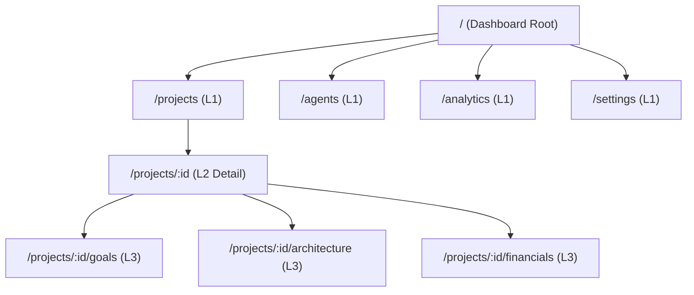

# Information Architecture (IA), OOUX & Navigation Systems

**Model:** Domain Entity Discovery → **Object-Oriented UX (OOUX) Modeling → Hierarchical Navigation & Site Maps → Taxonomy & Faceted Wayfinding → Breadcrumb & Cmd+K Routing**

This skill structures complex software into **intuitive, scalable Information Architecture (IA)**, preventing cognitive overload and ensuring users, search engines, and AI agents can navigate deep multi-entity systems with $< 3\text{ clicks}$.

Post-ship evolution: [soda-learning-loop](../soda-learning-loop/SKILL.md). Pairs with [soda-design](../soda-design/SKILL.md) and [soda-ux-research-heuristics](../soda-ux-research-heuristics/SKILL.md).

## First principles (do not skip)

| Principle | Meaning |
|-----------|---------|
| **3-Click wayfinding rule** | Any core system entity, metric, or action MUST be reachable within $\le 3\text{ clicks}$ from anywhere in the application. |
| **Object-Oriented UX (OOUX)** | Users think in objects (e.g. *Projects, Campaigns, Invoices, Agents*), not abstract pages. Define noun-based core domain objects before layout. |
| **Progressive disclosure** | Show high-level summaries by default; reveal advanced filters, nested metrics, and raw JSON configurations only on demand. |
| **Persistent orientation (Wayfinding)** | The user must always know: *Where am I? Where can I go? How do I get back?* (Clear active states, breadcrumbs, semantic URLs). |
| **Human approves top-level navigation changes** | Restructuring the root navigation bar, renaming core domain tabs, or altering global sitemaps requires human sign-off. |

## Where information architecture artifacts live

| Artifact | Path | Owner |
|----------|------|-------|
| **Information Architecture spec** | `docs/02-design/information-architecture.md` | product |
| **Site map & navigation tree** | `docs/02-design/site-map.md` | product |
| **OOUX & content domain model** | `docs/02-design/taxonomy-content-model.md` | product |

These are **product-owned** — `soda-os upgrade` never overwrites them.

## When this skill runs

| Rule | Agent must |
|------|-----------|
| Goal introduces new navigation trees, major page hierarchies, or complex search filters | **Auto-run this skill during PLAN & EXECUTE.** Author site map trees, OOUX object maps, and URL routing tables |
| User says **"information architecture G-xxx"** / **"ia G-xxx"** | Produce or refine the IA specification for that goal |
| User says **"site map"** / **"navigation tree"** | Stage 2 — design hierarchical and flat navigation structures |
| User says **"ooux"** / **"content model"** | Stage 1 — extract core domain nouns, relationships, and metadata attributes |
| User says **"taxonomy"** / **"faceted search"** | Stage 3 — define category tagging hierarchies and multi-select filter schemas |
| User says **"cmd+k"** / **"wayfinding"** | Stage 4 — configure global Command Palette fuzzy search index and breadcrumbs |

---

## The Information Architecture lifecycle (5 stages)

Run in order. Each stage has an **input**, a **deliverable**, and a **gate** before the next stage.

### Stage 1 — Object-Oriented UX (OOUX) entity mapping (PLAN)

Extract and map core business objects (the ORCA method: Objects, Relationships, Calls-to-action, Attributes):

```
  ┌─────────────────────────────────────────────────────────────┐
  │ OBJECT: Project (Core Entity)                               │
  ├─────────────────────────────────────────────────────────────┤
  │ • Attributes: ID, Title, Status, Budget, CreatedAt, Owner   │
  │ • Relationships: Has many Goals, Has many Deployments       │
  │ • Calls-to-Action (User): Create, Edit, Archive, Share      │
  │ • Nested Objects: Financial Graph, Persona Team, Logs       │
  └─────────────────────────────────────────────────────────────┘
```

**Deliverable:** OOUX entity matrix in `docs/02-design/taxonomy-content-model.md`.  
**Gate:** Core domain entities and parent-child hierarchies unambiguously defined.

### Stage 2 — Hierarchical Site Map & Navigation Tree (PLAN → EXECUTE)

Define visual and semantic navigation structure:
- **L1 Global Navigation:** Top-bar or Sidebar (max $5-7$ items based on Miller's Law $7 \pm 2$).
- **L2 Contextual Navigation:** Sub-tabs or sidebar accordions for entity-specific views.
- **L3 Granular Panels:** Tabs, drawers, and modal sheets.



**Deliverable:** Site map diagram in `docs/02-design/site-map.md`.  
**Gate:** Navigation depth does not exceed 3 levels for $90\%$ of user journeys.

### Stage 3 — Taxonomies, Tagging & Faceted Search Matrix (EXECUTE)

Define classification and filter hierarchies:
- **Taxonomy Type:** Mutually exclusive categories vs flat tagging ontology.
- **Faceted Search Filters:** Multi-attribute filtering (Status, Date Range, Team Member, Tags) with real-time result count badges.

**Deliverable:** Filter and taxonomy JSON schema.  
**Gate:** Zero dead-end filter combinations (empty states provide clear "Reset Filters" CTAs).

### Stage 4 — Wayfinding, Breadcrumbs & Universal Cmd+K Palette (EXECUTE)

1. **Semantic URL Schema:** RESTful and human-readable paths (e.g. `/workspaces/soda/projects/123/architecture`).
2. **Dynamic Breadcrumbs:** Auto-generated navigational trail with clickable ancestor nodes.
3. **Universal Command Palette (Cmd+K / Ctrl+K):** Global fuzzy-search index over all OOUX entities, actions, and settings.

**Deliverable:** Command palette indexing schema and breadcrumb component.  
**Gate:** Cmd+K query latency $\le 50\text{ms}$ returning instant grouped search results.

### Stage 5 — Cognitive Load & Card Sorting Validation (REVIEW)

- [ ] Tree testing verification: $100\%$ of key user tasks successfully located in $\le 3\text{ clicks}$.
- [ ] No orphan pages or untracked deep links in the routing table.
- [ ] Mobile responsive navigation pattern: Collapsible drawer with persistent bottom action bar.

---

## Governance (mandatory)

| Agent may | Agent must not |
|-----------|----------------|
| Structure navigation systems based on OOUX and progressive disclosure | Bury critical business workflows behind $> 4$ layers of nested menus |
| Implement universal Cmd+K fuzzy search palettes and semantic breadcrumbs | Create duplicate navigation routes leading to inconsistent entity states |
| Provide faceted multi-attribute filters with automatic reset mechanisms | Clutter top-level global navigation bars with $> 7$ primary menu items |

---

## Related

- [soda-figma-opendesign-bridge](../soda-figma-opendesign-bridge/SKILL.md) — Bi-directional Figma/OpenDesign IA bridge
- [soda-design](../soda-design/SKILL.md) — UI Component-First design
- [soda-ux-research-heuristics](../soda-ux-research-heuristics/SKILL.md) — Usability heuristics
- [soda-system-architecture](../soda-system-architecture/SKILL.md) — System boundaries & DDD
