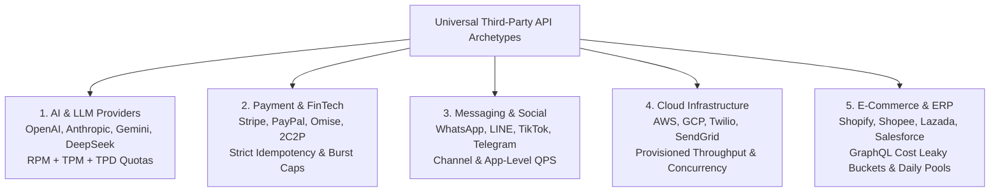
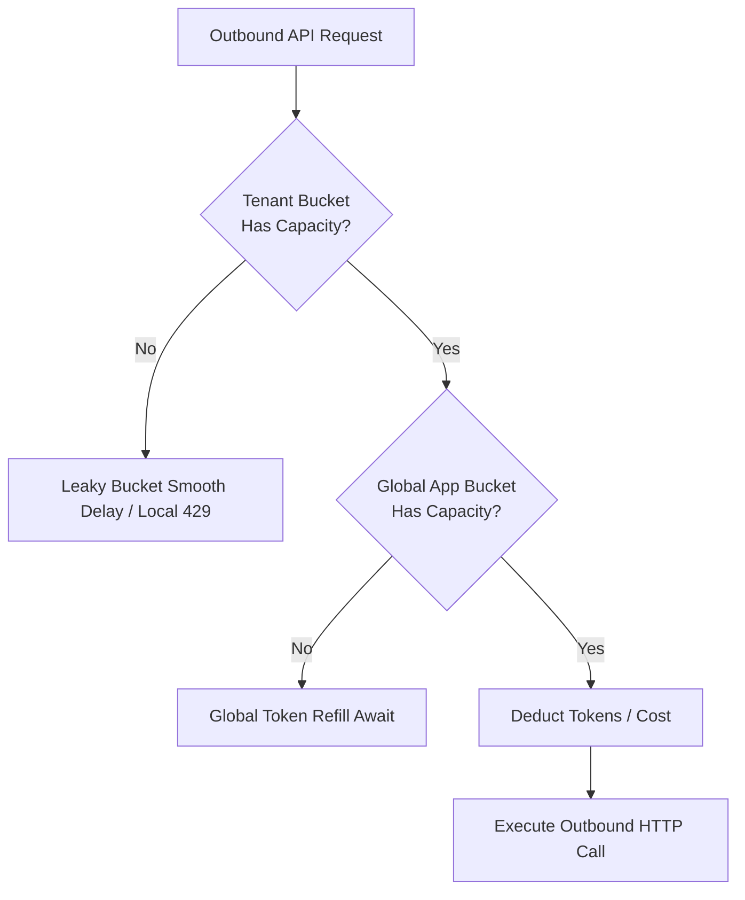
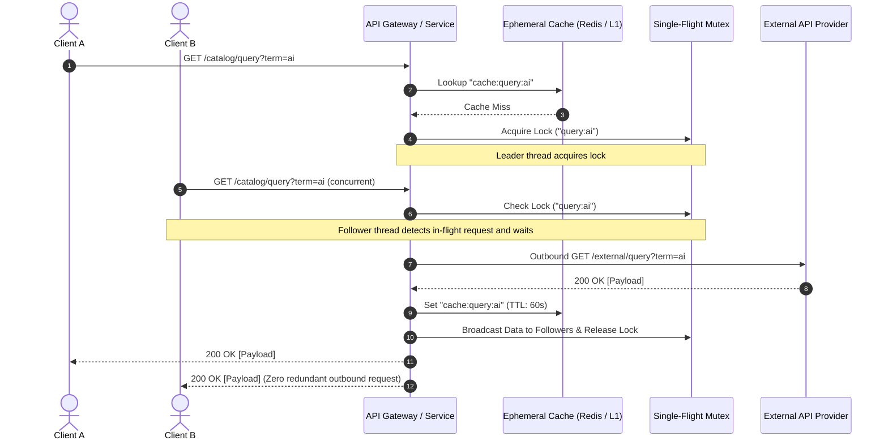
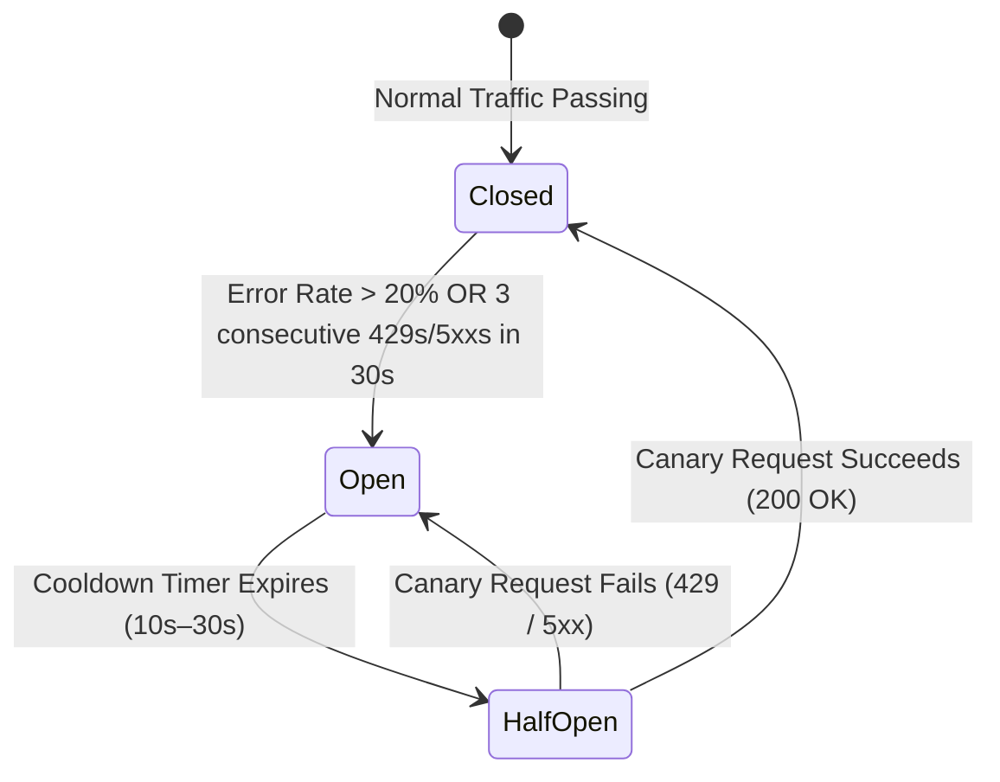

# Soda OS Universal Third-Party API Resilience & Outbound Governance

This skill guides engineers and autonomous agents through designing, implementing, hardening, and verifying enterprise-grade resilience for any external third-party API integration (AI & LLMs, Payment Gateways, Messaging & Social, Cloud Services, E-Commerce, and Enterprise SaaS).

```text
  ┌─────────────────────────────────────────────────────────────────────────────────────────────────┐
  │                 SODA OS 5-PILLAR UNIVERSAL API RESILIENCE PIPELINE                              │
  └────────────────────────────────────────────────┬────────────────────────────────────────────────┘
                                                   │
         ┌────────────────────────┬────────────────┼────────────────────────┬──────────────────────┐
         ▼                        ▼                ▼                        ▼                      ▼
┌──────────────────┐    ┌──────────────────┐ ┌───────────┐        ┌──────────────────┐  ┌──────────────────┐
│ 1. MULTI-TIER    │    │ 2. EPHEMERAL     │ │ 3. OUTBOX │        │ 4. CIRCUIT       │  │ 5. SEMANTIC 429  │
│    GOVERNOR      │    │    CACHE (L1/L2) │ │    WORKER │        │    BREAKER       │  │    TRANSLATION   │
├──────────────────┤    ├──────────────────┤ ├───────────┤        ├──────────────────┤  ├──────────────────┤
│ • Tenant & App   │    │ • Read-through   │ │ • Priority│        │ • Trip on >20%   │  │ • RFC 6585       │
│ • QPS & TPM Caps │    │   30s–300s TTL   │ │   Outbox  │        │   Errors / 429s  │  │   Standard HTTP  │
│ • Leaky Bucket   │    │ • Single-Flight  │ │ • Preempt │        │ • Exponential    │  │ • Retry-After    │
│   Smoothing      │    │   Stampede Guard │ │   Clock   │        │   Jitter Backoff │  │   Propagation    │
└──────────────────┘    └──────────────────┘ └───────────┘        └──────────────────┘  └──────────────────┘
```

---

## 1. When to Use This Skill

Invoke this skill whenever:
- **Designing or building integrations** with any external API (e.g. OpenAI/Anthropic LLMs, Stripe/PayPal, Meta/LINE/TikTok, AWS/GCP, Shopify/Amazon).
- **Hardening existing endpoints** against downstream HTTP 429 (`Too Many Requests`), vendor quota exhaustion, or cascading timeouts.
- **Implementing background sync, webhook dispatch, or event broadcast pipelines**.
- **Conducting Production Readiness Reviews (PRR)** under `soda-production-readiness-review`.

---

## 2. Universal API Provider Archetypes & Quota Patterns



---

## 3. The 5 Pillars of Enterprise API Resilience

### Pillar 1: Multi-Tier Outbound Rate Governor (Token Bucket & Leaky Bucket)



- **Mathematical Invariants:**
  - **Token Bucket (Burst-tolerant QPS):**
    $$\text{Tokens}(t) = \min\left(C, \text{Tokens}(t_{\text{prev}}) + r \cdot (t - t_{\text{prev}})\right)$$
  - **Dual Token & Token-Per-Minute (TPM for AI/LLMs):**
    $$\text{TokenPool}_{\text{request}} = \text{tokens} - 1, \quad \text{TokenPool}_{\text{TPM}} = \text{tokens} - \text{EstimatedTokens}(\text{prompt})$$
- **Tenant Isolation:** Every tenant/account has an isolated bucket to guarantee fair multi-tenant sharing.

---

### Pillar 2: Tiered Ephemeral Read Caching & Single-Flight Stampede Defense



- **L1 In-Memory + L2 Redis Ephemeral Cache:** 30s–300s TTL on idempotent read endpoints cuts third-party API traffic by **60%–90%**.
- **Single-Flight Coalescing:** Eliminates cache stampedes during high-concurrency bursts.
- **Stale-While-Revalidate (SWR):** When external latency spikes, returns stale cached data immediately while refreshing asynchronously.

---

### Pillar 3: Transactional Outbox & Preemptive Due-Work Schedulers

```mermaid
flowchart LR
  subgraph Ingest["1. Synchronous Ingest (Sub-5ms)"]
    Client[Client / App] -->|POST /mutation| API[API Gateway]
    API -->|ACID Transaction| DB[(PostgreSQL outbox_jobs)]
    API -->>|202 Accepted + Job UUID| Client
  end

  subgraph Worker["2. Preemptive Outbox Worker (Async)"]
    Poller[Preemptive Poller Clock] -->|FOR UPDATE SKIP LOCKED| DB
    Poller --> Gov[Rate Governor]
    Gov --> CB[Circuit Breaker]
    CB --> Ext[External Provider API]
    Ext -->|200 OK| MarkDone[Set status = 'completed']
    Ext -->|429 / 5xx| Reschedule[Reschedule with Full Jitter]
    Reschedule --> DB
  end
```

- **Transactional Schema:**
  ```sql
  CREATE TABLE outbox_jobs (
      job_id UUID PRIMARY KEY DEFAULT gen_random_uuid(),
      tenant_id UUID NOT NULL,
      provider VARCHAR(64) NOT NULL,
      job_type VARCHAR(64) NOT NULL,
      payload JSONB NOT NULL,
      status VARCHAR(32) NOT NULL DEFAULT 'pending',
      attempts INT NOT NULL DEFAULT 0,
      max_attempts INT NOT NULL DEFAULT 5,
      due_at TIMESTAMPTZ NOT NULL DEFAULT NOW(),
      idempotency_key VARCHAR(128) UNIQUE NOT NULL,
      last_error TEXT,
      created_at TIMESTAMPTZ NOT NULL DEFAULT NOW(),
      updated_at TIMESTAMPTZ NOT NULL DEFAULT NOW()
  );
  CREATE INDEX idx_outbox_due ON outbox_jobs(due_at, status) WHERE status IN ('pending', 'retry');
  ```
- **Advisory Lock Polling:**
  ```sql
  SELECT job_id, tenant_id, provider, payload FROM outbox_jobs
  WHERE due_at <= NOW() AND status IN ('pending', 'retry')
  ORDER BY due_at ASC
  LIMIT 50
  FOR UPDATE SKIP LOCKED;
  ```
- **Idempotency Propagation:** Every mutation carries a deterministic `Idempotency-Key` or `client_token` header.

---

### Pillar 4: Adaptive Circuit Breakers & Jittered Exponential Backoff



- **Closed State:** Normal operation with rolling error rate monitoring.
- **Open State (Fast-Fail):** Immediately blocks outbound traffic to the vendor; returns cached fallback or structured 503/429 without making network calls.
- **Half-Open State (Canary Probe):** Dispatches exactly 1 trial probe request to verify downstream recovery.
- **Decorrelated Full Jitter Backoff Formula:**
  $$t_{\text{backoff}} = \min\left(t_{\text{max}}, \text{rand}\left(0, 2^{\text{attempt}} \times t_{\text{base}}\right)\right)$$

---

### Pillar 5: Standardized RFC 6585 Semantic HTTP 429 Translation

```http
HTTP/1.1 429 Too Many Requests
Content-Type: application/json
Retry-After: 5
X-RateLimit-Limit: 100
X-RateLimit-Remaining: 0
X-RateLimit-Reset: 1724578800

{
  "error": "THIRD_PARTY_RATE_LIMITED",
  "vendor": "openai",
  "category": "ai",
  "message": "Downstream AI provider rate limit exceeded. Please retry after cooldown.",
  "retry_after_sec": 5,
  "resilience_action": "queued_for_retry"
}
```

---

## 4. Multi-Language Reference Implementations

### A. Universal Token Bucket Governor (Rust / Tokio)

```rust
use std::sync::Arc;
use tokio::sync::Mutex;
use std::time::{Duration, Instant};
use axum::{
    http::{StatusCode, HeaderMap, HeaderValue},
    response::{IntoResponse, Response},
    Json,
};
use serde_json::json;

#[derive(Clone)]
pub struct UniversalRateGovernor {
    capacity: f64,
    refill_rate: f64,
    tokens: Arc<Mutex<(f64, Instant)>>,
}

impl UniversalRateGovernor {
    pub fn new(capacity: f64, refill_rate: f64) -> Self {
        Self {
            capacity,
            refill_rate,
            tokens: Arc::new(Mutex::new((capacity, Instant::now()))),
        }
    }

    pub async fn try_acquire(&self, cost: f64) -> Result<(), Duration> {
        let mut state = self.tokens.lock().await;
        let now = Instant::now();
        let elapsed = now.duration_since(state.1).as_secs_f64();
        
        // Refill tokens
        state.0 = (state.0 + elapsed * self.refill_rate).min(self.capacity);
        state.1 = now;

        if state.0 >= cost {
            state.0 -= cost;
            Ok(())
        } else {
            let missing = cost - state.0;
            let wait_secs = missing / self.refill_rate;
            Err(Duration::from_secs_f64(wait_secs.max(0.1)))
        }
    }
}

pub fn make_rfc6585_429_response(vendor: &str, category: &str, retry_after_sec: u64) -> Response {
    let mut headers = HeaderMap::new();
    headers.insert(
        axum::http::header::RETRY_AFTER,
        HeaderValue::from_str(&retry_after_sec.to_string()).unwrap(),
    );

    let body = Json(json!({
        "error": "THIRD_PARTY_RATE_LIMITED",
        "vendor": vendor,
        "category": category,
        "message": format!("Downstream {} rate limit exceeded. Please retry after cooldown.", vendor),
        "retry_after_sec": retry_after_sec,
    }));

    (StatusCode::TOO_MANY_REQUESTS, headers, body).into_response()
}
```

---

### B. Universal Single-Flight Stampede Guard (TypeScript / Node.js)

```typescript
export class SingleFlight<T> {
  private inFlight = new Map<string, Promise<T>>();

  async do(key: string, fn: () => Promise<T>): Promise<T> {
    const existing = this.inFlight.get(key);
    if (existing) {
      return existing;
    }

    const promise = fn().finally(() => {
      this.inFlight.delete(key);
    });

    this.inFlight.set(key, promise);
    return promise;
  }
}
```

---

## 5. Verification & Testing Pass Checklist

Before approving any goal touching third-party APIs:

- [ ] **Dual-Level Governor Verified:** Both Global App-Key and Tenant-level rate ceilings enforced.
- [ ] **Ephemeral Cache Active:** Idempotent read endpoints cached with 30s–300s TTL.
- [ ] **Single-Flight Lock Verified:** Concurrent identical requests dispatch exactly 1 outbound call.
- [ ] **Transactional Outbox Verified:** Mutations committed to `outbox_jobs` with non-blocking worker polling.
- [ ] **Circuit Breaker Verified:** Trips to `Open` under 429/5xx bursts and fast-fails safely.
- [ ] **RFC 6585 Error Semantics:** Returns HTTP 429 with standard `Retry-After` header.
- [ ] **Zero Stubs / Zero Mocks:** 100% genuine operational resilience logic verified via tests.
