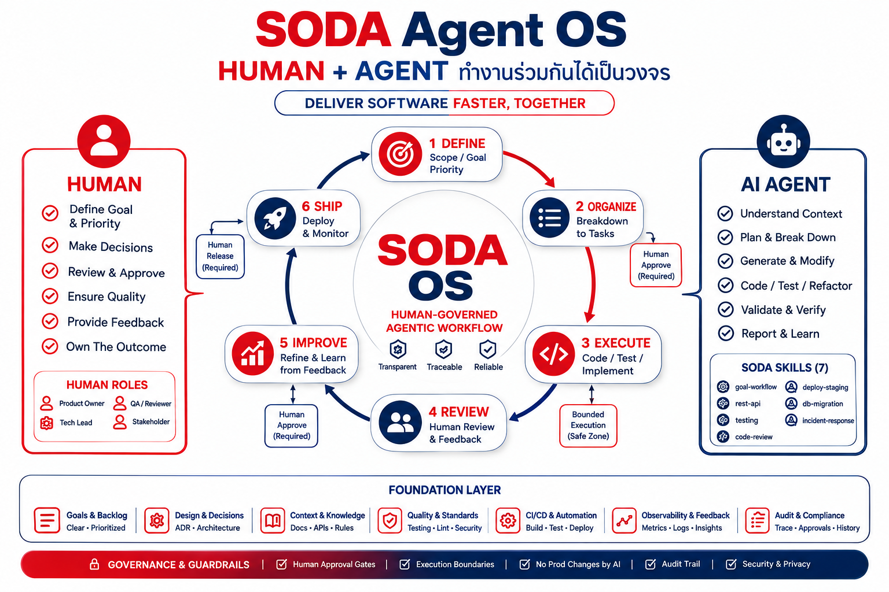
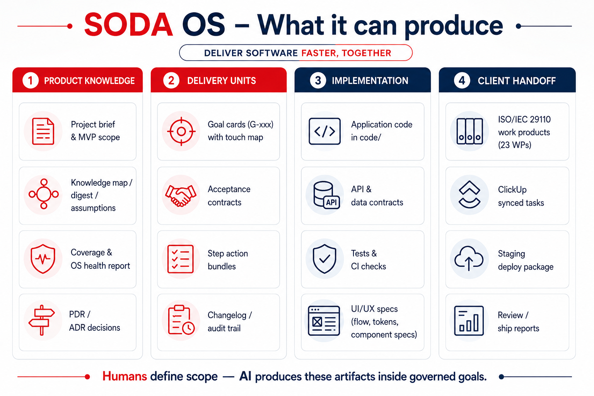

# Soda Agent OS

**Sodality** — goal-driven Human + Agent development with **governance layer** for human-approved AI delivery.

```text
Soda Agent OS = Context + Skill + Goal + Governance + Approval + Audit
```

Copy this **Agent OS** into a new project (`soda-os init`) or **upgrade** an existing one (`soda-os upgrade`). **Process, skills, and rules ship complete**; fill product docs and `code/` per project.

## Human + Agent cycle (collaboration phases — PR-First)

SODA OS is a human-governed agentic workflow: **Transparent, Traceable, Reliable.** Cycle: **DEFINE → PLAN → EXECUTE → REVIEW → SHIP (PR-First)**, with human approval gates, dedicated `feature/G-xxx` branch isolation, zero local integration merging, and PR-first delivery into `develop`.



Framework map: [docs/03-architecture/design-spec.md](docs/03-architecture/design-spec.md) · Terminology: design-spec §8 · Collaboration cycle: [docs/06-workflows/team-workflow.md](docs/06-workflows/team-workflow.md) · GitHub Governance: [docs/06-workflows/github-governance.md](docs/06-workflows/github-governance.md)

## What it can produce

Humans define scope — AI produces these artifacts inside governed goals.



---

## Team workflow (start here)

1. **[docs/06-workflows/team-workflow.md](docs/06-workflows/team-workflow.md)** — collaboration cycle, Mermaid diagrams, command-trigger cheat sheet
2. **[AGENTS.md](AGENTS.md)** — AI entry point (agents read first every session)
3. **[docs/04-agents/skills-library.md](docs/04-agents/skills-library.md)** — 10 versioned Soda skills

---

## Quick start — new project

### 0. Get Agent OS

```bash
git clone git@github.com:Sodality-Company-Limited/soda-os.git soda-os
cd soda-os
```

### 1. Bootstrap

**Linux / macOS / Git Bash (requires `rsync`):**

```bash
soda-os init /path/to/my-new-project "My Project Name"
cd /path/to/my-new-project
```

**Windows (PowerShell — no rsync):**

```powershell
.\scripts\bootstrap.ps1 C:\path\to\my-new-project "My Project Name"
cd C:\path\to\my-new-project
```

### 2. Fill product docs (Planner)

| File | Purpose |
|------|---------|
| [docs/02-product/project-brief.md](docs/02-product/project-brief.md) | Canonical product spec |
| [docs/03-architecture/overview.md](docs/03-architecture/overview.md) | Stack & system context |
| [docs/07-backlog/goals.md](docs/07-backlog/goals.md) | G-001, G-002, … |
| [docs/00-project-snapshot.md](docs/00-project-snapshot.md) | TL;DR for agents |
| [docs/05-decisions/](docs/05-decisions/) | Replace example ADR with real decisions |

**Keep unchanged:** `design-spec.md`, `soda-*` skills, process workflows.

### 3. Customize agent entry & CI

| File | Customize |
|------|-----------|
| [AGENTS.md](AGENTS.md) | Mission, `{TEST_COMMANDS}` |
| [.agents/rules/{stack}.md](.agents/rules/) | Copy from `stack-*.example.md` |
| [.github/ci-config.yml](.github/ci-config.example.yml) | Copy example → set test/lint at G-001 |

Governance rules (`governance.md`, `security.md`) and GitHub workflows ship complete — do not remove.

Enable **branch protection** after first push: [docs/06-workflows/github-governance.md](docs/06-workflows/github-governance.md)

### 4. Start first dev round

Set **G-001** to `ready`, then in Cursor:

```
อ่าน AGENTS.md แล้วทำ G-001 ตาม goals.md
```

Agent จะแสดง **todo step tracker** ด้านบนแชท (อ่าน progress จากนั้น) — พิมพ์ `เริ่ม step 1` เมื่อพร้อมให้ลงมือโค้ด

```
ใช้ soda-testing และ soda-code-review ก่อนปิด goal
```

---

## Upgrade existing project

Two-phase upgrade — script alone is not enough for project-specific files.

```bash
# 1. Drift report (input for Cursor agent)
soda-os upgrade /path/to/existing-app --report

# 2. Phase 1 — mechanical framework sync
soda-os upgrade /path/to/existing-app --yes

# 3. Phase 2 — attach soda-upgrade-os skill in Cursor:
#    "อัปเกรด Agent OS สำหรับ /path/to/existing-app — ทำ Phase 2 merge"
```

See [docs/06-workflows/upgrade-agent-os.md](docs/06-workflows/upgrade-agent-os.md) and [framework-manifest.yml](framework-manifest.yml).

**Do not** run `soda-os init` on an existing repo — it overwrites product files.

---

## Sync goal to ClickUp (State Transition Invariant)

Every goal state transition (`draft` / `planned` → `ready` → `in_progress` → `review` → `approved` → `done`, or `blocked`) triggers a status sync to ClickUp. Task name is derived from H1 and description from `## Context` to end of file (excludes `#### Plan`).

### Setup (once per project)

```bash
cd /path/to/my-project
cp scripts/clickup.config.example.json scripts/clickup.config.json
# Edit listId + statusMap to match your ClickUp List
export CLICKUP_API_TOKEN=pk_... # (or CLICKUP_API_KEY=pk_...)
```

`listId` is the ClickUp **List** ID (from URL `.../li/123456789`). All goals synced from that repo go to that List — the script does not guess Space/List.

### Commands

From project root (after `soda-os upgrade` shipped `scripts/goals/sync-clickup.js`):

```bash
soda-os sync-clickup --list                  # goals in this repo
soda-os sync-clickup G-030 --dry-run         # preview payload
export CLICKUP_API_TOKEN=pk_...              # if not set yet
soda-os sync-clickup G-030                   # create or update task
soda-os sync-clickup G-030 --status-only     # sync status only on state transition
soda-os sync-clickup --all                   # sync all active goals
soda-os sync-clickup --all --status-only     # update statuses only for all goals
```

From another directory:

```bash
soda-os sync-clickup G-030 /path/to/litter-green-nextjs
soda-os sync-clickup --all /path/to/litter-green-nextjs
```

Equivalent long form: `node scripts/goals/sync-clickup.js G-030` or `--all` (same flags).

Details: [docs/06-workflows/goal-spec-guide.md](docs/06-workflows/goal-spec-guide.md) · `scripts/clickup.config.example.json`

---

```text
DEFINE → PLAN → EXECUTE → REVIEW → SHIP (PR-First)
```

| Collaboration phase | Skill (agent) |
|-------|---------------|
| PLAN / any goal | `soda-goal-workflow` |
| API work | `soda-rest-api` |
| Tests | `soda-testing` |
| Before done | `soda-code-review` |
| Staging | `soda-deploy-staging` |
| Upgrade OS | `soda-upgrade-os` |
| Schema | `soda-db-migration` |
| 3rd-Party APIs | `soda-thirdparty-api-resilience` |
| Incidents | `soda-incident-response` |

---

## How to assign work (cheat sheet)

| ✅ Good | ❌ Avoid |
|---------|----------|
| ทำ G-003 ตาม goals.md | ทำแอปให้เสร็จ |
| review G-003 ตาม code-review skill | merge โดยไม่ review |
| ship G-003 / สร้าง PR | merge เข้า develop/main ในเครื่อง |
| ต่อ goal ready ถัดไป | refactor ทั้ง repo |
| commit G-003 | commit ทุกอย่างที่แก้ |

**Humans define scope — AI implements on feature branches — Humans review and merge PRs.**

---

## Folder map

```text
AGENTS.md                      ← AI entry point
.agents/
  rules/                       ← core, governance, security, guidelines, commits, stack
  skills/soda-*/               ← standard skills (versioned)
docs/
  00-index.md                  ← doc map
  00-project-snapshot.md       ← agent reload TL;DR
  01-vision.md                 ← optional principles
  02-product/                  ← brief, scope, acceptance contracts
  03-architecture/
    design-spec.md             ← framework map (do not remove)
    overview.md, folder-structure.md
    api/                       ← API contracts (fill per goal)
    data/                      ← business rules (fill per goal)
  04-agents/                   ← dev roles, skills-library
  05-decisions/                ← ADR template + example
  06-workflows/                ← dev loop, DoD, team-workflow, github-governance
  07-backlog/                  ← goals, changelog-goals, audit changelog
  assets/                      ← diagrams (add at bootstrap when needed)
.github/
  workflows/                   ← governance + CI
  pull_request_template.md
  ci-config.example.yml
docker/                        ← optional
code/                          ← application source (fill at G-001)
soda-os init                   ← new projects
soda-os upgrade                ← existing projects (framework only)
soda-os sync-clickup           ← push G-xxx or all goals to ClickUp
soda-os pr                     ← generate PR payload & checklist for G-xxx
```

---

## Project-specific extensions

Add only when a convention is unique to one product:

```text
.agents/skills/{project}-api/SKILL.md
.agents/rules/{stack}.md
```

Register in [docs/04-agents/skills-library.md](docs/04-agents/skills-library.md) and [AGENTS.md](AGENTS.md).

---

Maintained by **Sodality**.
GitHub: [Sodality-Company-Limited/soda-os](https://github.com/Sodality-Company-Limited/soda-os)
