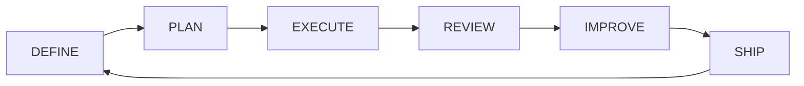

# Design spec — Soda Human + Agent framework

> **Soda Agent OS — canonical framework** for every Sodality project.  
> Maps the [Human + Agent cycle](../06-workflows/team-workflow.md) to this repository structure.

Copy this Agent OS via `soda-os init`; process docs and skills stay **unchanged** across projects. Product content (`brief`, `goals`, `code/`) is filled per project.

---

## 1. Collaboration cycle (6 phases)



| Collaboration phase | Human | AI agent | Framework location | Skill |
|-------|-------|----------|-------------------|-------|
| **DEFINE** | Scope / goal / priority | Interview → distill → decide | `docs/02-product/`, `knowledge-digest`, `assumptions`, PDR | `soda-discovery` |
| **PLAN** | Make decision | Plan & execute; design UI/UX | Goal block, `docs/05-decisions/`, `docs/03-architecture/ux/`, `docs/02-product/design/` | `soda-goal-workflow`, `soda-design` |
| **EXECUTE** | — | Generate & modify | `code/`, `.agents/rules/` | task-specific `soda-*` (`soda-rest-api`, `soda-design`, …) |
| **REVIEW** | Review & improve | Report & learn | Acceptance criteria, human diff | `soda-code-review` |
| **IMPROVE** | Ensure quality | Test & validate | `definition-of-done.md` | `soda-testing` |
| **SHIP** | Own the outcome | Prepare deploy, report | CI, staging env | `soda-deploy-staging` |

**Human onboarding:** [team-workflow.md](../06-workflows/team-workflow.md)  
**Agent entry:** [AGENTS.md](../../AGENTS.md)  
**Skill catalog:** [skills-library.md](../04-agents/skills-library.md)

---

## 2. Single source of truth — folder mapping

| Infographic | Purpose | Framework path | Shipped |
|-------------|---------|---------------|---------|
| `/docs` | Project overview | `docs/00-index.md`, `docs/01-vision.md`, `README.md` | ✅ |
| `/requirements` | PRD & requirements | `docs/02-product/` (brief, digest, assumptions) | ✅ |
| `/iso29110` | Formal client WP templates | `docs/08-iso29110/` + generated `work-products/` | ✅ |
| `/api` | API contracts | `docs/03-architecture/api/` | ✅ |
| `/architecture` | System design | `docs/03-architecture/` | ✅ |
| `/guidelines` | Coding standards | `.agents/rules/`, `soda-*` skills | ✅ |
| `/data` | Business rules | `docs/03-architecture/data/` | ✅ |
| `/assets` | References, diagrams | `docs/assets/` | ✅ |

**Cursor agent layers (required):**

| Layer | Path |
|-------|------|
| Entry point | `AGENTS.md` |
| Always-on rules | `.agents/rules/` |
| Playbooks | `.agents/skills/soda-*/` |
| Application | `code/` |

---

## 3. Seven pillars — shipped in Agent OS

### Pillar 1: Single source of truth

Numbered `docs/` tree, `AGENTS.md`, `00-index.md`, `api/`, `data/`, `assets/`.

### Pillar 2: ADR & PDR

- ADR template: [0000-template.md](../05-decisions/0000-template.md) — architecture / technical
- PDR template: [pdr-0000-template.md](../05-decisions/pdr-0000-template.md) — product / scope tradeoffs
- Format example: [0001-example-postgresql.md](../05-decisions/0001-example-postgresql.md) *(replace on bootstrap)*

**Knowledge OS:** [os-core-invariants.md](../06-workflows/os-core-invariants.md) · [os-health.md](../02-product/os-health.md) · [knowledge-loop.md](../06-workflows/knowledge-loop.md)

### Pillar 3: Goal queue

[goals.md](../07-backlog/goals.md) — **goal status flow** `draft` → `ready` → `in_progress` → `review` → `approved` → `done` (plus `blocked`), with dependencies, acceptance criteria, touch map, test plan. IDs: [goal-id.md](../06-workflows/goal-id.md). Terminology: §8.

Acceptance contracts: [acceptance/](../02-product/acceptance/) — per-goal testable scenarios.

### Pillar 4: Repeatable skills (versioned)

Ten standard skills in [skills-library.md](../04-agents/skills-library.md). Add `{project}-*` skills only for project-specific conventions.

### Pillar 5: Governance & approval

Always-on rules: [.agents/rules/governance.md](../../.agents/rules/governance.md), [security.md](../../.agents/rules/security.md).

Hard gates: no merge to main, prod deploy, infra, destructive migrations, or auth changes without human approval.

### Pillar 6: Audit trail

- Goal completions: [changelog-goals.md](../07-backlog/changelog-goals.md)
- Session decisions: [changelog.md](../07-backlog/changelog.md)

### Pillar 7: CI hard guards (GitHub)

- Workflows: [.github/workflows/](../../.github/workflows/) — `governance.yml`, `ci.yml`
- PR template: [pull_request_template.md](../../.github/pull_request_template.md)
- Setup: [github-governance.md](../06-workflows/github-governance.md)
- Scripts: [scripts/ci/](../../scripts/ci/)

---

## 4. Agent OS layers

```text
Soda Agent OS = Context + Skill + Goal + **Knowledge Governance** + Approval + Audit
```

| Layer | Mechanism |
|-------|-----------|
| **Context** | `AGENTS.md`, [00-project-snapshot.md](../00-project-snapshot.md), brief, digest, assumptions, ADR/PDR, API |
| **Skill** | `soda-*` playbooks |
| **Goal** | `goals.md` + acceptance contracts |
| **Governance** | `governance.md`, `security.md`, Project scope |
| **Approval** | Human REVIEW / SHIP; `approved` before `done` |
| **Audit** | `changelog.md`, `changelog-goals.md` |
| **CI** | GitHub Actions + protected branches (human enables) |

---

## 5. Role split

| Human | Mechanism |
|-------|-----------|
| Define goal | `goals.md` — PO / lead |
| Make decision | ADR in `docs/05-decisions/` |
| Review & improve | Reviewer + `soda-code-review` |
| Ensure quality | DoD + `soda-testing` |
| Own the outcome | Human requests commit; approves SHIP |

| AI agent | Mechanism |
|----------|-----------|
| Understand context | `AGENTS.md` read-first |
| Plan & execute | `soda-goal-workflow` + active goal |
| Generate & modify | Touch map + task skills |
| Test & validate | Test plan + `soda-testing` |
| Report & learn | Summary, changelog; no auto-commit |

---

## 6. Per-project customization (bootstrap only)

| Item | When | Where |
|------|------|-------|
| Product spec | Bootstrap | `project-brief.md` |
| Stack & commands | Bootstrap | `overview.md`, `AGENTS.md` `{TEST_COMMANDS}` |
| Real ADRs | First arch decision | Replace `0001-example-*` |
| Stack rules | Bootstrap | Copy `stack-*.example.md` → `{stack}.md` |
| App CI config | G-001 | Copy `ci-config.example.yml` → `ci-config.yml` |
| Agent OS upgrade | Any time | [soda-os upgrade](../.soda-os upgrade) + [upgrade-agent-os.md](../06-workflows/upgrade-agent-os.md) |
| Branch protection | After first push | [github-governance.md](../06-workflows/github-governance.md) |
| Goals G-001+ | Planning | `goals.md` |
| Application code | G-001+ | `code/` |

**Do not remove** Soda standard skills or process docs when bootstrapping from Agent OS.

---

## 7. Knowledge + context architecture

| Layer | Doc | Who reads |
|-------|-----|-----------|
| **Services** | [knowledge-services.md](knowledge-services.md) | Skills (capabilities) |
| **Context compiler + IR** | [context-compiler.md](context-compiler.md) · [compiler-ir.md](compiler-ir.md) |
| **Coordination** | [coordination.md](coordination.md) — shared memory, capability matrix |
| **Repository** | [knowledge-store.md](knowledge-store.md) | Implementers |
| **Storage** | JSON → SQLite → API | Phase-driven |

**Three levels:** Knowledge · Execution · Coordination.  
**Next:** Sprint A–C — real projects, extract PB/REC/capability, shared memory — **no new layers.**

Storage rollout uses **roadmap phase** (Phase 1 JSON → Phase 2 SQLite) — not a collaboration phase.

---

## 8. Terminology (canonical)

Single source of truth for names used across rules, skills, schemas, and goals.  
When docs disagree, this section wins.

### Do not overload "mode"

| Term | Meaning | Values / location |
|------|---------|-------------------|
| **Collaboration phase** | Where the project is in the Human + Agent cycle (§1) | `DEFINE`, `PLAN`, `EXECUTE`, `REVIEW`, `IMPROVE`, `SHIP` |
| **Goal status** | State of one goal (`G-PAY-001` or legacy `G-001`) in the backlog | `draft`, `planned`, `ready`, `in_progress`, `review`, `approved`, `done`, `blocked` |
| **Goal ID** | Allocation key — [goal-id.md](../06-workflows/goal-id.md) | `G-{EPIC}-{NNN}` per epic; legacy `G-{NNN}` = epic `CORE`. Filename equals ID. |
| **Operating mode** | Governance exception overlay | `Normal` (default), `Incident` (human declares) — [governance.md](../../.agents/rules/governance.md) |
| **Response level** | Chat vs repo edit depth | Level 0–3 — [artifact-conservation.md](../../.agents/rules/artifact-conservation.md) |
| **Bundle mode** | Context compiler parameter on `compile()` / action bundle | `execute`, `review`, `discover`, `plan` — maps to collaboration phase; see [context-compiler.md](context-compiler.md) |

There is **no** separate "conversation mode" system. Routing uses **command triggers** (user phrasing) + goal status + collaboration phase.

### Collaboration phase ↔ goal status ↔ skill (typical)

| Collaboration phase | Typical goal status | Primary skill / behavior |
|---------------------|---------------------|--------------------------|
| DEFINE | `draft`, `planned` | `soda-discovery` — docs/map only |
| PLAN | `ready` (await **"ทำ G-xxx"**; after **clarify** / **spec check**) | `soda-goal-workflow` — goal spec, no code |
| EXECUTE | `in_progress` | Task skills + compiled bundle (`bundle mode: execute`) |
| REVIEW | `review`, then `approved` | `soda-code-review` |
| IMPROVE | (during REVIEW handoff) | `soda-testing`, DoD |
| SHIP | `done` → archived | `soda-deploy-staging` |

**Disambiguation:** collaboration phase **REVIEW** is not the same word as goal status **`review`** — the status is one step inside the REVIEW phase.

### Command triggers (routing)

User phrasing that selects behavior without a mode switch. Tables live in [team-workflow.md](../06-workflows/team-workflow.md), [soda-goal-workflow](../../.agents/skills/soda-goal-workflow/SKILL.md), and [soda-discovery](../../.agents/skills/soda-discovery/SKILL.md).

Examples: `discover` → DEFINE; **`clarify G-xxx`** / **`spec check G-xxx`** → PLAN (no code); **`analyze G-xxx`** → before EXECUTE; **"ทำ G-xxx"** → TodoWrite only; **"เริ่ม step N"** → EXECUTE; `review G-xxx` → goal status `review` + code-review skill.

### Bundle mode ↔ collaboration phase

| Bundle mode | Collaboration phase | Default bundle contents |
|-------------|---------------------|-------------------------|
| `execute` | EXECUTE | Step md, action yaml, touch map, recipe checklist |
| `review` | REVIEW | Acceptance, diff checklist, code-review skill refs |
| `discover` | DEFINE | Digest, assumptions, discovery checklist — no `code/` |
| `plan` | PLAN | Goal spec, In/Out, acceptance draft — no `code/` |

Phase 1 compiler defaults **`bundle mode: execute`** on **"เริ่ม step N"**. Other bundle modes are valid in schema for non-step compiles; behavior follows the same phase rules above.

### Aliases (backward compatible)

| Alias | Canonical |
|-------|-----------|
| Human + Agent cycle, 6-phase cycle, Soda phase (in goal Plan) | **Collaboration phase** |
| Goal state machine | **Goal status flow** |
| Incident mode, normal mode | **Operating mode:** Incident / Normal |
| Context resolver; hydrate / resolve | **Context compiler**; `compile G-xxx` |
| Skill "Trigger" column | **Command trigger** |
| Phase 1 / Phase 2 (knowledge store, upgrade) | **Roadmap phase** |

### Dead or misleading terms (do not use for new text)

| Avoid | Use instead |
|-------|-------------|
| "mode" alone | Name the kind: operating / bundle / response |
| "phase" for JSON-vs-SQL rollout | **Roadmap phase** |
| "phase" for chat routing | **Command trigger** + collaboration phase |
| "Plan mode" / "Execute mode" (chat) | Collaboration phase **PLAN** / **EXECUTE** |

---

## Related

- [coordination.md](coordination.md)
- [compiler-ir.md](compiler-ir.md)
- [knowledge-services.md](knowledge-services.md)
- [knowledge-store.md](knowledge-store.md)
- [../00-index.md](../00-index.md)
- [../04-agents/skills-library.md](../04-agents/skills-library.md)
- [../06-workflows/team-workflow.md](../06-workflows/team-workflow.md)
- [../../README.md](../../README.md)
