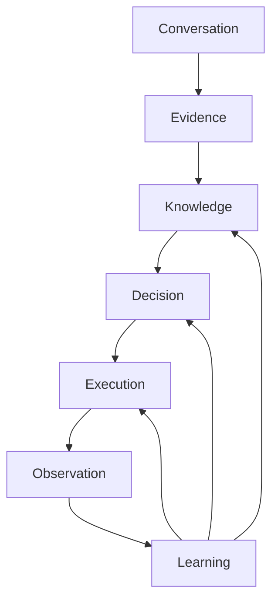

# Knowledge loop — Source of evolution

> **For humans and agents.** Full closed loop from conversation to organizational learning.
> **Stability:** [os-core-invariants.md](os-core-invariants.md) (Core vs Extension — **no new layers**)
> **Health:** [os-health.md](../02-product/os-health.md) · command **`os health`**

Discovery: [soda-discovery](../../.agents/skills/soda-discovery/SKILL.md)
Learning: [soda-learning-loop](../../.agents/skills/soda-learning-loop/SKILL.md)

Runtime graph via **Knowledge Services** (Phase 1 backend: [knowledge-map.json](../02-product/knowledge-map.json)) — tune **extensions** from real project data, not new framework layers.
Architecture: [knowledge-services.md](../03-architecture/knowledge-services.md) · [knowledge-store.md](../03-architecture/knowledge-store.md)

---

## Stability first (read before extending)

| | Architecture-driven ✓ done | Evidence-driven → now |
|--|---------------------------|------------------------|
| Question | "What layer is missing?" | "What do projects measure?" | "Is context retrieval layered?" |
| Action | Tune thresholds · **`os health`** | **`compile G-xxx`** before collaboration phase EXECUTE |

**Core invariants (4):** no orphan goals · reviewable decisions · temporal knowledge · learning must change something.

Full contract: [os-core-invariants.md](os-core-invariants.md)

---

## Maturity model

| Version | Name | Mechanism |
|---------|------|-----------|
| v1 | Prompt engineering | Ad-hoc AI answers |
| v2 | Goal engineering | G-xxx, acceptance |
| v3 | Knowledge engineering | Evidence, map, confidence, coverage |
| v4 | Decision engineering | PDR ↔ ADR ↔ Goal graph |
| v5 | **Organizational learning** | Pattern library + export from outcomes |
| **v6** | **Organizational intelligence** | Ranked pattern recommend — human ADR/PDR gate |

**Governance** (all levels): [knowledge-governance.md](knowledge-governance.md) — owner/approver matrix.

**Ship target:** v3–v4 per project + learning loop + traceability + governance docs. v5 patterns: [org-patterns/](../04-agents/org-patterns/README.md). v6: ranked recommend spec in [organizational-learning.md](organizational-learning.md).

---

## Full loop (seven phases)

```text
Conversation → Evidence → Knowledge → Decision → Execution
                                                    ↓
                                              Observation
                                                    ↓
                                              Learning
                                                    ↺ (knowledge update)
```

| Phase | Question | Anti-pattern |
|-------|----------|--------------|
| Conversation | What did stakeholders say? | Transcript in repo |
| Evidence | **From what source, when?** | Untraceable claims |
| Knowledge | What signal, how confident? | Static forever |
| Decision | What did we choose? | Slack-only |
| Execution | What did we ship? | Goal without pain link |
| **Observation** | **What happened after ship?** | Done = forget |
| **Learning** | **What should change?** | Repeat same mistake |



---

## Temporal knowledge (time matters)

Knowledge is valid **until evidence ages out** or **contradicts**.

| Field | On |
|-------|-----|
| `last_validated` | E-xxx, P-xxx, A-xxx, decisions |
| `expires_after` | `date + freshness_days` (default **180**) |
| `needs_review` | `true` when expired or challenged |

**Example:** Pain P-001 "Users don't use dark mode" (E-001, Jan 2026). Jul 2026 analytics E-010 → 90% adoption → **supersede** P-001, not ignore.

Agent on `knowledge audit` / `learn`: list all `needs_review`; block promote while critical nodes stale.

---

## Conflict graph

When sources disagree — **do not promote** until resolved.

```json
{
  "id": "CF-001",
  "status": "open",
  "topic": "Dark mode demand",
  "summary": "Interview A wants; Interview B hates; analytics 5%",
  "nodes": ["P-001", "P-002"],
  "evidence": ["E-001", "E-002", "E-003"]
}
```

| Resolution | When |
|------------|------|
| `evidence_wins` | Newer/higher-quality evidence (e.g. analytics beats single interview) |
| `pdr` | Product choice despite conflict |
| `supersede` | Replace old pain with new |
| `defer` | Explicitly park for v2 |

`promote_gates.block_on_open_conflicts: true` (default).

---

## Learning loop (post-execution)

After G-xxx **`done`** or SHIP:

1. **Observe** — register `O-xxx` (metrics, support, UAT, deploy)
2. **Learn** — apply `learning_actions` on map
3. **Evolve** — supersede pains, invalidate assumptions, draft new goals

Human log: [learning-log.md](../02-product/learning-log.md)

Triggers: **`observe`** · **`learn`** · **`post-ship G-xxx`**

---

## Agent commands

| Command | Skill | Action |
|---------|-------|--------|
| `discover` | soda-discovery | Interview + evidence |
| `coverage` | soda-discovery | Coverage % |
| `knowledge audit` | soda-discovery | Graph + temporal + conflicts |
| `promote digest` | soda-discovery | Gates then promote |
| `observe` / `learn` | soda-learning-loop | Post-ship evolution |
| `post-ship G-xxx` | soda-learning-loop | Goal-scoped learning |
| `os health` | soda-discovery | System KPI dashboard |
| `pattern search` | soda-discovery | Query org pattern-index (v5/v6) |
| `ทำ G-xxx` | soda-goal-workflow | Display todos (no code) |
| `clarify G-xxx` | soda-goal-workflow | Don't-guess markers |
| `spec check G-xxx` | soda-goal-workflow | Spec checklist |
| `analyze G-xxx` | soda-goal-workflow | Cross-artifact before execute |

---

## Promote gates (summary)

Before goals → `ready`:

- [ ] Coverage: pain + boundary 100%; avg ≥ 80%
- [ ] No open `CF-xxx` conflicts
- [ ] No critical `needs_review` nodes
- [ ] **Traceability** ≥ `min_score_ready` (`trace G-xxx`)
- [ ] **Spec stability:** clarify + spec check `done`; no `[NEEDS CLARIFICATION]`
- [ ] Knowledge audit clean
- [ ] [Knowledge governance](knowledge-governance.md) — human approver for `ready`

Before first **`เริ่ม step N`**:

- [ ] **`analyze G-xxx`** `done` or `n/a` (docs-only)

Before goals → `done`:

- [ ] **Traceability** ≥ `min_score_done` (observation link required)
- [ ] **`post-ship G-xxx`** learning offered/completed

---

## v5 — organizational learning (direction)

When a project closes, export anonymized **patterns** (decision + evidence + outcome) — not just docs. New projects treat patterns as **low-confidence hypotheses** until local E-xxx validates.

See [organizational-learning.md](organizational-learning.md).

---

## Related

- [os-core-invariants.md](os-core-invariants.md)
- [os-health.md](../02-product/os-health.md)
- [knowledge-services.md](../03-architecture/knowledge-services.md)
- [knowledge-store.md](../03-architecture/knowledge-store.md)
- [knowledge-map.json](../02-product/knowledge-map.json)
- [learning-log.md](../02-product/learning-log.md)
- [team-workflow.md](team-workflow.md)
- [goal-spec-guide.md](goal-spec-guide.md)
