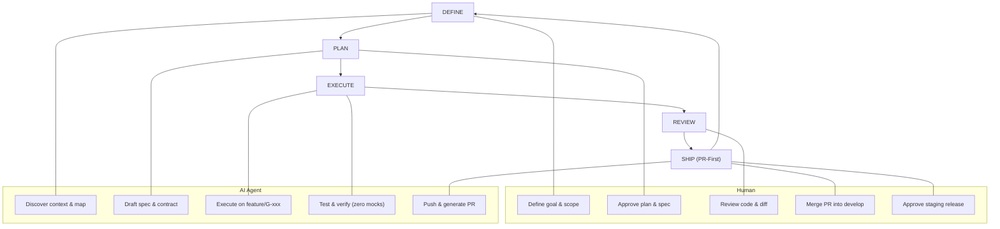
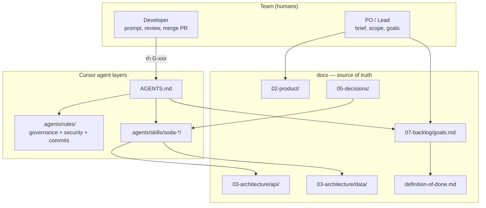
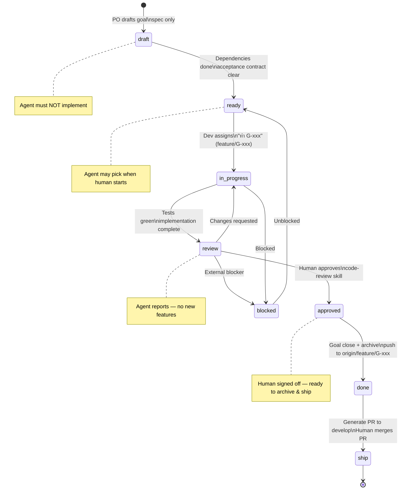
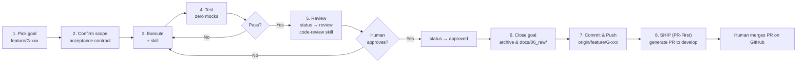
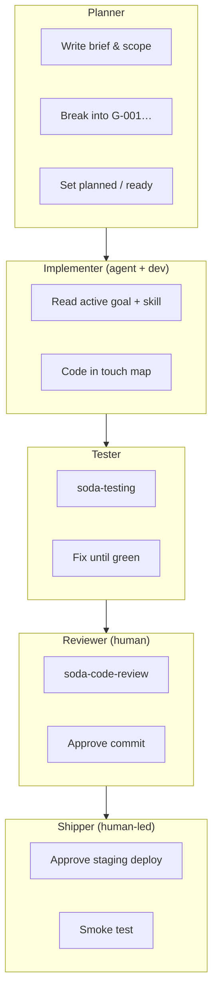
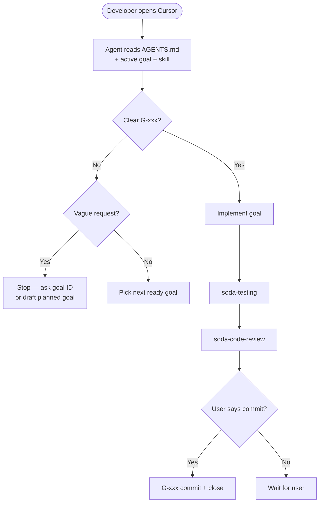

# Team workflow — goal-driven development with AI agents

> **For humans.** AI agents: read [AGENTS.md](../../AGENTS.md) and [dev-loop.md](dev-loop.md).

This document explains how **Sodality** runs every project with Cursor agents — goals, rules, and versioned skills so Human + Agent collaboration stays scoped and reviewable.

Framework reference: [design-spec.md](../03-architecture/design-spec.md) · Collaboration cycle: [team-workflow.md](team-workflow.md)

---

## 1. Human + Agent cycle (PR-First)



| Collaboration phase | Human | Agent | Docs / skills |
|-------|-------|-------|---------------|
| DEFINE | Scope, priority, discovery | Interview → evidence → map → PDR | `knowledge-map.json`, `knowledge-digest`, `assumptions`, brief, `soda-discovery` |
| PLAN | ADR, goal breakdown, **clarify / spec check** | Confirm scope, branch isolation on `feature/G-xxx`, ClickUp sync `ready` | `soda-goal-workflow` |
| EXECUTE | — | Code & test in touch map on `feature/G-xxx` after **`analyze G-xxx`**; ClickUp sync `in_progress` | `soda-rest-api`, `soda-db-migration`, `soda-testing`, … |
| REVIEW | Approve / request changes | Report diff, 5-lens audit, ClickUp sync `review` → `approved` | `soda-code-review` |
| SHIP (PR-First) | Review PR & merge into `develop`; approve staging deploy | Archive goal, ClickUp sync `done`, push to `origin/feature/G-xxx`, generate PR & checklist | `soda-goal-workflow` §8, `soda-deploy-staging` |

---

## 2. Big picture — where everything lives



| Layer | Who writes it | Who consumes it |
|-------|---------------|-----------------|
| `docs/02-product/` | PO / lead | Everyone + agent |
| `docs/03-architecture/api/`, `data/` | Dev + agent (per goal) | Everyone + agent |
| `docs/07-backlog/goals.md` | Planner | Agent picks **one** `ready` goal |
| `docs/05-decisions/` | Tech lead | Agent when linked in goal |
| `.agents/rules/` | Soda Agent OS + stack | Agent always |
| `.agents/skills/soda-*/` | Soda Agent OS | Agent when task matches |
| `AGENTS.md` | Bootstrap customize | Agent first read |

---

## 3. Goal lifecycle



---

## 4. One dev round (one goal — PR-First)



**Rule:** One goal = dedicated `feature/G-xxx` branch = zero local merge = one reviewable PR slice into `develop`.

---

## 5. Roles in one session



Same person can wear all hats — the **documents and skills** keep roles explicit.

---

## 6. How to talk to the agent



### Prompt cheat sheet

| ✅ Good | ❌ Avoid |
|---------|----------|
| discover — เริ่มสัมภาษณ์ Step 1 | ทำแอปให้เสร็จ (ไม่มี goal) |
| os health | OS KPI dashboard |
| trace G-xxx | Traceability % |
| pattern search | auto-accept ADR จาก pattern โดยไม่มี E-xxx |
| intake change — {อธิบายการเปลี่ยน} | promote goal ready โดยไม่ audit |
| ทำ G-005 ตาม goals.md | brief G-005 สับสนกับ discover |
| review diff G-005 | merge ให้เลย |
| approve G-005 | agent ปิด done เอง |
| deploy staging ตาม G-010 | deploy prod เอง |
| ต่อ goal ready ถัดไป | refactor ทั้ง repo |
| commit G-005 | commit ทุกอย่างที่แก้ |

### Bootstrap prompts (new project)

**Discovery (no code yet):**

```
discover
อ่าน soda-discovery skill และ knowledge-loop.md
เริ่ม Step 1 — Business — ถามทีละ step
บันทึก Evidence (E-xxx) + sync knowledge-map.json และ knowledge-digest.md
ยังไม่เขียน production code ยังไม่ promote goals เป็น ready
```

**Planner (after discovery locked):**

```
อ่าน AGENTS.md, project-brief.md, knowledge-digest.md
ช่วยแตก goals G-001… (planned) — บันทึก PDR สำหรับการตัด scope ที่ตัดไปแล้ว
ยังไม่เขียน production code
```

**First implementation:**

```
อ่าน AGENTS.md แล้วทำ G-001 ตาม goals.md
ใช้ soda-testing + soda-code-review ก่อนปิด goal
อย่า commit จนกว่าฉันจะสั่ง
```

---

## 7. Standard skills (always available)

See [skills-library.md](../04-agents/skills-library.md) for versions and changelog.

| Skill | Command triggers |
|-------|---------|
| `soda-learning-loop` | `observe`, `learn`, `post-ship G-xxx` |
| `soda-discovery` | `discover`, `coverage`, `trace G-xxx`, `pattern search`, change intake |
| `soda-goal-workflow` | Any G-xxx work · `clarify G-xxx` · `spec check G-xxx` · `analyze G-xxx` |
| `soda-rest-api` | API endpoints |
| `soda-testing` | Tests |
| `soda-code-review` | Before done / PR |
| `soda-deploy-staging` | SHIP / staging |
| `soda-incident-response` | Incidents |
| `soda-db-migration` | Schema changes |

## GitHub hard guards

See [github-governance.md](../06-workflows/github-governance.md) — PR template, governance CI, protected branches.

Add `{project}-*` skills only for conventions unique to one product.

---

## Related

- [dev-loop.md](dev-loop.md)
- [definition-of-done.md](definition-of-done.md)
- [../07-backlog/changelog.md](../07-backlog/changelog.md) — audit trail
- [github-governance.md](github-governance.md)
- [../04-agents/dev-roles.md](../04-agents/dev-roles.md)
- [../04-agents/skills-library.md](../04-agents/skills-library.md)
- [../07-backlog/goals.md](../07-backlog/goals.md)
- [../../AGENTS.md](../../AGENTS.md)
