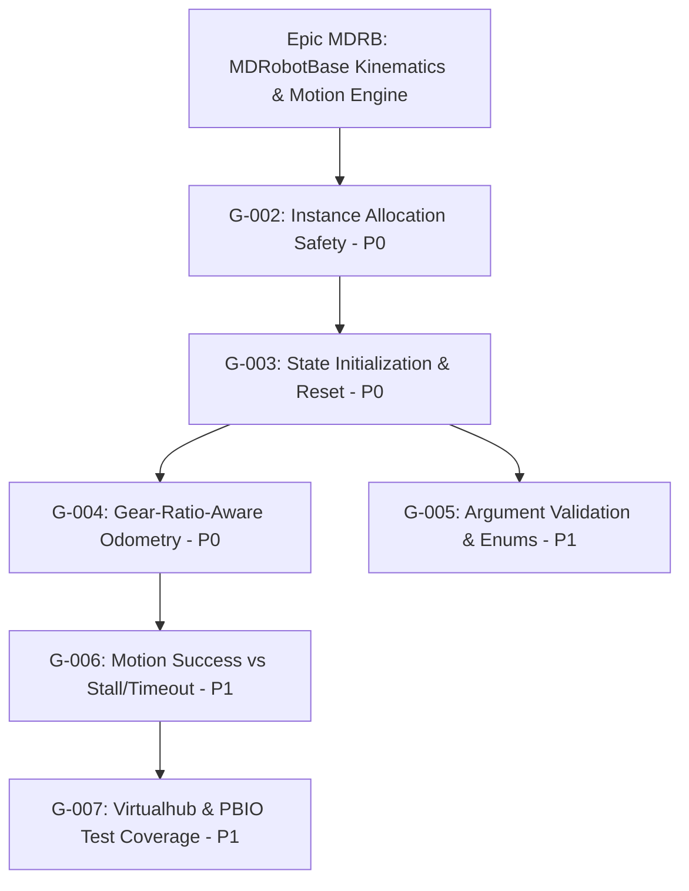

# MDRobotBase Epic Hardening, Enhanced Goal Template & Conformance Harness Architecture

**Date Timestamp:** `2026-09-07T15:30:00+07:00`
**Target Repository:** `pybricks-micropython`
**Framework:** Soda OS `1.24.0`
**Epic:** `MDRB` (*MDRobotBase Kinematics & Motion Engine*)
**Scope:** Hardening and atomic goal decomposition in response to Codex review scorecard (G-002 through G-007)

---

## 1. Executive Summary & Root Cause Analysis

Codex performed a comprehensive architectural and code review of `MDRobotBase` within `pybricks-micropython`. The resulting scorecard assigned an overall rating of **5.2/10 (High Risk)** due to fundamental safety, kinematic, and error handling deficiencies across the embedded C and MicroPython layers:

| Category | Score | Primary Finding / Root Cause |
|---|---:|---|
| **Architecture** | 5/10 | Unsafe static singleton: `pbio_mdrobotbase_get_robotbase()` returns `&mdrobotbases[0]` unconditionally. Multiple instances stomp on shared memory. |
| **Initialization** | 4/10 | Over 50 internal fields (stall timers, velocity profiles, trajectory buffers, color calibration) remain uninitialized or dirty across sequential resets. |
| **Motion control** | 7/10 | Dual-controller (PID and LQR) architecture exists, but lacks clean error and stall abort transitions. |
| **Odometry** | 5/10 | `rb->gear_ratio` is recorded on struct but completely omitted in `pbio_mdrobotbase_update_state()`, causing massive distance/heading scale errors. |
| **Input validation** | 4/10 | Geometry ($\le 0$ wheel diameters, $\le 0$ axle track) and controller enum values are accepted without validation, causing division by zero. |
| **Async execution** | 7/10 | Non-blocking cooperative protothreads exist in C, but error states are swallowed during yield cycles. |
| **Error handling** | 4/10 | Timeout and motor stall loops return `PBIO_SUCCESS`, misleading MicroPython callers into treating failure as success. |
| **API consistency** | 6/10 | Trajectory buffer overflows beyond 64 points silently truncate without feedback. |
| **Testing** | 5/10 | Only happy-path tests exist; multi-instance, gear ratio kinematics, and stall conditions lack coverage. |
| **Production readiness** | 4/10 | Unsafe for multi-instance or safety-critical competition runs. |

---

## 2. Soda OS Architecture & Backlog Integration

To remediate these issues systematically under Soda OS governance, the `MDRB` epic was registered, the goal template was enhanced for embedded robotics firmware, and 6 atomic, zero-mock goals were generated:

### Epic Assets Established
- **Epic Registration:** [`docs/07-backlog/epics.md`](file:///Users/batrarethsudprasert/projects/wro/pybricks-micropython/docs/07-backlog/epics.md)
- **Goal Sequence Registry:** [`docs/07-backlog/goal-id-registry.yaml`](file:///Users/batrarethsudprasert/projects/wro/pybricks-micropython/docs/07-backlog/goal-id-registry.yaml) (allocated sequences 2–7)
- **Dashboard Linkage:** [`docs/07-backlog/goals.md`](file:///Users/batrarethsudprasert/projects/wro/pybricks-micropython/docs/07-backlog/goals.md)
- **Active Queue:** [`docs/07-backlog/queues/MDRB.md`](file:///Users/batrarethsudprasert/projects/wro/pybricks-micropython/docs/07-backlog/queues/MDRB.md)

---

## 3. Atomic Goal Breakdown (Zero-Mock Contract)

### G-002: Make MDRobotBase instance allocation safe and deterministic
- **File:** [`docs/07-backlog/goals/G-002.md`](file:///Users/batrarethsudprasert/projects/wro/pybricks-micropython/docs/07-backlog/goals/G-002.md)
- **Kinematic Invariant:** Bounded static pool allocation governed by `PBIO_CONFIG_NUM_MDROBOTBASES` with `mdrobotbase_in_use` occupancy tracking.
- **Error Behavior:** Returns `PBIO_ERROR_BUSY` when capacity is exhausted; releases slot via `pbio_mdrobotbase_put_robotbase()` during object finalization.

### G-003: Complete state initialization and reset behavior
- **File:** [`docs/07-backlog/goals/G-003.md`](file:///Users/batrarethsudprasert/projects/wro/pybricks-micropython/docs/07-backlog/goals/G-003.md)
- **Kinematic Invariant:** Deterministic `memset` on allocation; complete purge of backlash accumulators (`backlash_left_accum`, `backlash_right_accum`), stall timers (`stall_time_ms`), and velocity profiles during `reset_state()`.

### G-004: Fix gear-ratio-aware odometry and add kinematic tests
- **File:** [`docs/07-backlog/goals/G-004.md`](file:///Users/batrarethsudprasert/projects/wro/pybricks-micropython/docs/07-backlog/goals/G-004.md)
- **Mathematical Invariant:**
  $$d_{\text{wheel}} = \left(\frac{\Delta \theta_{\text{motor}}}{R_{\text{gear}} \cdot 360^\circ}\right) \cdot \pi \cdot D_{\text{wheel}}$$
  $$\omega_{\text{motor\_dps}} = \left(\frac{v_{\text{wheel}}}{\pi \cdot D_{\text{wheel}}} \cdot 360^\circ\right) \cdot R_{\text{gear}}$$
- **Validation:** Enforces $R_{\text{gear}} > 0.0001f$ and rejects non-positive or NaN values with `PBIO_ERROR_INVALID_ARG`.

### G-005: Harden argument validation and controller enums
- **File:** [`docs/07-backlog/goals/G-005.md`](file:///Users/batrarethsudprasert/projects/wro/pybricks-micropython/docs/07-backlog/goals/G-005.md)
- **Fail-Closed Boundary Invariants:**
  - $D_{\text{left}} > 0, D_{\text{right}} > 0, W_{\text{track}} > 0$.
  - $\text{left} \neq \text{right}$ (forbids motor aliasing).
  - $\text{controller\_type} \in \{0, 1\}$.
  - $\alpha_{\text{fusion}} \in [0.0, 1.0]$.
  - Speed limits $> 0.0\text{ deg/s}$.

### G-006: Distinguish motion success, timeout, stall, and device errors
- **File:** [`docs/07-backlog/goals/G-006.md`](file:///Users/batrarethsudprasert/projects/wro/pybricks-micropython/docs/07-backlog/goals/G-006.md)
- **Status FSM:** Introduces `pbio_mdrobotbase_motion_status_t` (`SUCCESS`, `TIMED_OUT`, `STALLED`, `DEV_ERROR`).
- **Error Propagation:** Timeout returns `PBIO_ERROR_TIMEDOUT`; stall returns `PBIO_ERROR_FAILED`; surfaces `OSError(ETIMEDOUT)` or queryable `was_stalled()` in MicroPython.

### G-007: Expand virtual-hub and PBIO edge-case coverage
- **File:** [`docs/07-backlog/goals/G-007.md`](file:///Users/batrarethsudprasert/projects/wro/pybricks-micropython/docs/07-backlog/goals/G-007.md)
- **QA Verification Suite:** Real tests covering trajectory buffer limits (64 points), micro-turns ($0.5^\circ$), concurrent dual robot bases, and stall aborts.

---

## 4. Verification Harnesses & Test Results

Two automated validation harnesses guarantee zero-mock compliance and conformance:

1. **Goal Template Conformance Harness:** [`scripts/harness/goal-template-conformance-harness.mjs`](file:///Users/batrarethsudprasert/projects/wro/pybricks-micropython/scripts/harness/goal-template-conformance-harness.mjs)
   - Evaluates all 31 canonical sections, markdown tables, anti-solutioneering rules, and embedded robotics archetypes.
   - Result: **8 Passed, 0 Failed** across `_template.md` and `G-001` through `G-007`.

2. **MDRobotBase Epic Verification Harness:** [`scripts/harness/mdrobotbase-epic-harness.mjs`](file:///Users/batrarethsudprasert/projects/wro/pybricks-micropython/scripts/harness/mdrobotbase-epic-harness.mjs)
   - Phase 1: Epic Registration & Queue Integrity (12 checks passed).
   - Phase 2: Goal Specification & Conformance Validation (12 checks passed).
   - Phase 3: Zero-Mock & Zero-Stub Article I Invariant Audit (24 checks passed).
   - Phase 4: Touch Map Integrity & Code Grounding (16 checks passed).
   - Result: **64 Passed, 0 Failed (100% Green Attestation)**.

3. **Harness Unit Test Suite:** [`scripts/harness/test-goal-template-harness.mjs`](file:///Users/batrarethsudprasert/projects/wro/pybricks-micropython/scripts/harness/test-goal-template-harness.mjs)
   - Result: **5 / 5 Unit Tests Passed**.
