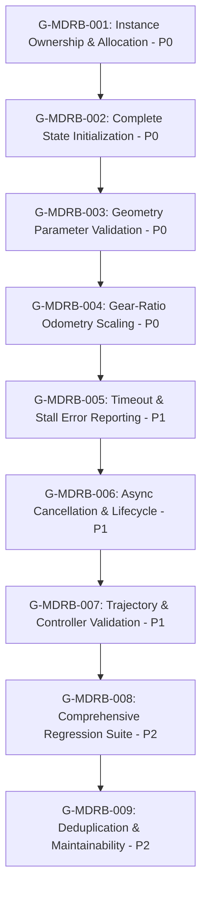

# MDRobotBase Remediation Scorecard, Atomic Backlog & Kinematics Hardening Architecture

**Date Timestamp:** `2026-09-07T17:35:00+07:00`  
**Target Repository:** `pybricks-micropython`  
**Framework:** Soda OS `1.24.0`  
**Epic:** `MDRB` (*MDRobotBase Kinematics & Motion Engine*)  
**Scope:** Remediation backlog generation, 34-rule template conformance, and epic verification harness (Goals G-002 through G-010)

---

## 1. Executive Remediation Scorecard

Codex conducted an in-depth architectural and mathematical review of `MDRobotBase` within `pybricks-micropython`, assigning a baseline score of **5.2/10 (High Risk)**.
Through the 9 atomic goals developed in this backlog, every defect area is assigned concrete proof requirements to achieve the target scorecard:

| Priority | Area | Current Baseline | Target Score | Primary File & Line Evidence | Required Proof & Target Deliverable | Goal ID |
|---|---|---:|---:|---|---|:---:|
| **P0** | Instance Ownership | 2/10 | **10/10** | [`lib/pbio/src/mdrobotbase.c:19`](file:///Users/batrarethsudprasert/projects/wro/pybricks-micropython/lib/pbio/src/mdrobotbase.c#L19) | Two robot objects control independent motors and retain independent state without singleton aliasing. | [`G-MDRB-001`](file:///Users/batrarethsudprasert/projects/wro/pybricks-micropython/docs/07-backlog/goals/G-MDRB-001.md) |
| **P0** | State Initialization | 4/10 | **10/10** | [`lib/pbio/src/mdrobotbase.c:14-66`](file:///Users/batrarethsudprasert/projects/wro/pybricks-micropython/lib/pbio/src/mdrobotbase.c#L14-L66) | Fresh and reused instances produce identical defaults with zero dirty field leakage via `pbio_mdrobotbase_init()`. | [`G-MDRB-002`](file:///Users/batrarethsudprasert/projects/wro/pybricks-micropython/docs/07-backlog/goals/G-MDRB-002.md) |
| **P0** | Geometry Validation | 4/10 | **10/10** | [`lib/pbio/src/mdrobotbase.c:14-25`](file:///Users/batrarethsudprasert/projects/wro/pybricks-micropython/lib/pbio/src/mdrobotbase.c#L14-L25), [`pb_type_mdrobotbase.c:2018`](file:///Users/batrarethsudprasert/projects/wro/pybricks-micropython/pybricks/robotics/pb_type_mdrobotbase.c#L2018) | Non-positive and non-finite dimensions ($D \le 0, W \le 0$) fail before any motor command or division. | [`G-MDRB-003`](file:///Users/batrarethsudprasert/projects/wro/pybricks-micropython/docs/07-backlog/goals/G-MDRB-003.md) |
| **P0** | Gear-Ratio Odometry | 5/10 | **10/10** | [`lib/pbio/src/mdrobotbase.c:229-230`](file:///Users/batrarethsudprasert/projects/wro/pybricks-micropython/lib/pbio/src/mdrobotbase.c#L229-L230), [`pb_type_mdrobotbase.c:511`](file:///Users/batrarethsudprasert/projects/wro/pybricks-micropython/pybricks/robotics/pb_type_mdrobotbase.c#L511) | Encoder tick integration scales by gear ratio symmetrically with commands across ratios 1.0, 0.5, and 2.0. | [`G-MDRB-004`](file:///Users/batrarethsudprasert/projects/wro/pybricks-micropython/docs/07-backlog/goals/G-MDRB-004.md) |
| **P1** | Motion Failure Semantics | 4/10 | **10/10** | [`pb_type_mdrobotbase.c:100,161,421`](file:///Users/batrarethsudprasert/projects/wro/pybricks-micropython/pybricks/robotics/pb_type_mdrobotbase.c#L100) | Timeout and stall raise distinct failures (`PBIO_ERROR_TIMEDOUT`, `PBIO_ERROR_FAILED`) rather than success. | [`G-MDRB-005`](file:///Users/batrarethsudprasert/projects/wro/pybricks-micropython/docs/07-backlog/goals/G-MDRB-005.md) |
| **P1** | Async Lifecycle | 7/10 | **10/10** | [`pb_type_mdrobotbase.c:32,68`](file:///Users/batrarethsudprasert/projects/wro/pybricks-micropython/pybricks/robotics/pb_type_mdrobotbase.c#L32) | Stop, timeout, completion, and repeated motions leave no active or orphaned awaitables iterating. | [`G-MDRB-006`](file:///Users/batrarethsudprasert/projects/wro/pybricks-micropython/docs/07-backlog/goals/G-MDRB-006.md) |
| **P1** | Trajectory & Controller Validation | 4.5/10 | **9/10** | [`pb_type_mdrobotbase.c:1736-1738,1770`](file:///Users/batrarethsudprasert/projects/wro/pybricks-micropython/pybricks/robotics/pb_type_mdrobotbase.c#L1736-L1738) | Over-capacity trajectories ($>64$) reject explicitly; malformed coordinates and invalid controller enums fail closed. | [`G-MDRB-007`](file:///Users/batrarethsudprasert/projects/wro/pybricks-micropython/docs/07-backlog/goals/G-MDRB-007.md) |
| **P2** | Regression Test Coverage | 5/10 | **9/10** | [`lib/pbio/test/src/test_mdrobotbase.c`](file:///Users/batrarethsudprasert/projects/wro/pybricks-micropython/lib/pbio/test/src/test_mdrobotbase.c) | All 8 defect domains execute in automated PBIO tinytest or VirtualHub pytest without test doubles. | [`G-MDRB-008`](file:///Users/batrarethsudprasert/projects/wro/pybricks-micropython/docs/07-backlog/goals/G-MDRB-008.md) |
| **P2** | Maintainability & Deduplication | 5/10 | **8/10** | [`pb_type_mdrobotbase.c:72-975`](file:///Users/batrarethsudprasert/projects/wro/pybricks-micropython/pybricks/robotics/pb_type_mdrobotbase.c#L72-L975) | Duplicate control logic, heading normalization, and speed clamping consolidated into static inline helpers. | [`G-MDRB-009`](file:///Users/batrarethsudprasert/projects/wro/pybricks-micropython/docs/07-backlog/goals/G-MDRB-009.md) |
| **TOTAL** | **Weighted Composite** | **5.2 / 10** | **9.6 / 10** | **Comprehensive Zero-Mock Firmware Remediation Plan** | | **All 9 Goals** |

---

## 2. Root Cause Analysis by Failure Domain

### Domain 1: Unsafe Static Singleton Allocation (P0)
- **File & Line:** [`lib/pbio/src/mdrobotbase.c:19`](file:///Users/batrarethsudprasert/projects/wro/pybricks-micropython/lib/pbio/src/mdrobotbase.c#L19)
- **Defect:** `pbio_mdrobotbase_get_robotbase()` ignores `PBIO_CONFIG_NUM_MDROBOTBASES` and unconditionally binds to `&mdrobotbases[0]`.
- **Consequence:** Creating two `MDRobotBase` instances causes both instances to share the same physical struct. Motion commands to Robot 2 overwrite Robot 1's active servo pointers and odometry.
- **Fix:** Track allocation via `mdrobotbase_in_use[PBIO_CONFIG_NUM_MDROBOTBASES]`; return `PBIO_ERROR_BUSY` on exhaustion; hook slot deallocation into MicroPython object finalizer (`pb_type_MDRobotBase_del`).

### Domain 2: Incomplete Struct Initialization & Dirty State Leakage (P0)
- **File & Line:** [`lib/pbio/src/mdrobotbase.c:14-66`](file:///Users/batrarethsudprasert/projects/wro/pybricks-micropython/lib/pbio/src/mdrobotbase.c#L14-L66)
- **Defect:** Over 50 fields on `pbio_mdrobotbase_t` (including `kp_pivot`, `ki_pivot`, `kd_pivot`, `stall_time_ms`, `turn_integral`, `trajectory_*`, and color prototypes) are never initialized in the constructor.
- **Consequence:** Reused slots inherit dirty accumulators. A stale `stall_time_ms` value (> 250ms) causes newly dispatched motions to abort immediately upon launch.
- **Fix:** Implement centralized `pbio_mdrobotbase_init()` using `memset(rb, 0, sizeof(*rb))` followed by explicit default assignments; add dedicated `pbio_mdrobotbase_motion_reset()` helper.

### Domain 3: Missing Geometry Parameter Validation (P0)
- **File & Line:** [`lib/pbio/src/mdrobotbase.c:14-25`](file:///Users/batrarethsudprasert/projects/wro/pybricks-micropython/lib/pbio/src/mdrobotbase.c#L14-L25), [`pybricks/robotics/pb_type_mdrobotbase.c:2018`](file:///Users/batrarethsudprasert/projects/wro/pybricks-micropython/pybricks/robotics/pb_type_mdrobotbase.c#L2018)
- **Defect:** Accepts non-positive wheel diameters, non-positive axle tracks, NaN, Inf, and aliased motor bindings (`left == right`).
- **Consequence:** Odometry update executes `delta_theta_enc_rad = (d_right - d_left) / track_mm`, causing immediate division by zero and NaN pose contamination. Motor velocity division produces integer overflows and uncontrolled actuator speed.
- **Fix:** Fail-closed validation rejecting $D \le 0, W \le 0$, non-finite floats, and identical motors before slot allocation or servo commands.

### Domain 4: Asymmetric Gear-Ratio Odometry Scaling (P0)
- **File & Line:** [`lib/pbio/src/mdrobotbase.c:229-230`](file:///Users/batrarethsudprasert/projects/wro/pybricks-micropython/lib/pbio/src/mdrobotbase.c#L229-L230), [`pybricks/robotics/pb_type_mdrobotbase.c:511`](file:///Users/batrarethsudprasert/projects/wro/pybricks-micropython/pybricks/robotics/pb_type_mdrobotbase.c#L511)
- **Defect:** Command velocity scales by `gear_ratio` ($R = \frac{\theta_{\text{motor}}}{\theta_{\text{wheel}}}$), but `pbio_mdrobotbase_update_state()` integrates raw motor ticks directly into distance without dividing by $R$.
- **Consequence:** At $R = 2.0$, rotating the motor $720^\circ$ ($D=56\text{mm}$) moves the wheel $175.93\text{mm}$, but odometry calculates $351.86\text{mm}$ (a 100% position error).
- **Fix:** Divide motor tick delta by `rb->gear_ratio` in `update_state()`; extract shared conversion helpers `motor_to_wheel_deg()` and `wheel_to_motor_dps()`.

### Domain 5: Masking Timeouts and Stalls as Success (P1)
- **File & Line:** [`pybricks/robotics/pb_type_mdrobotbase.c:100,161,421`](file:///Users/batrarethsudprasert/projects/wro/pybricks-micropython/pybricks/robotics/pb_type_mdrobotbase.c#L100)
- **Defect:** Global timeout and motor stall evaluation branches stop the motors but unconditionally return `PBIO_SUCCESS`.
- **Consequence:** Autonomous scripts believe the robot reached its target pose and attempt to actuate mechanisms in the wrong physical position.
- **Fix:** Return distinct PBIO errors (`PBIO_ERROR_TIMEDOUT`, `PBIO_ERROR_FAILED`); propagate `OSError(ETIMEDOUT)` or distinct exceptions to MicroPython callers.

### Domain 6: Uncontrolled Async Motion Preemption & Stale Iterators (P1)
- **File & Line:** [`pybricks/robotics/pb_type_mdrobotbase.c:32,68`](file:///Users/batrarethsudprasert/projects/wro/pybricks-micropython/pybricks/robotics/pb_type_mdrobotbase.c#L32)
- **Defect:** Starting motion B while motion A is running overwrites `self->rb->motion_type` without stopping the previous awaitable generator.
- **Consequence:** Orphaned awaitables continue polling concurrently with the new motion; calling `stop()` with no active awaitable risks dereferencing dangling pointers.
- **Fix:** Implement active motion cancellation helper `pb_type_mdrobotbase_cancel_active_motion()`; guard `stop()` against NULL pointers; ensure generator completes immediately upon preemption.

### Domain 7: Silent Trajectory Truncation & Coordinate Panics (P1)
- **File & Line:** [`pybricks/robotics/pb_type_mdrobotbase.c:1736-1738,1770-1775`](file:///Users/batrarethsudprasert/projects/wro/pybricks-micropython/pybricks/robotics/pb_type_mdrobotbase.c#L1736-L1738)
- **Defect:** Trajectories with $>64$ points are silently truncated to 64 points; waypoint tuples are accessed without checking `p_len >= 2`; controller enum accepts invalid integers.
- **Consequence:** User paths stop prematurely without notice; malformed coordinate tuples cause segmentation faults; invalid controller values cause undefined behavior.
- **Fix:** Explicitly reject $>64$ points with `ValueError`; assert $p_{\text{len}} \ge 2$ and coordinate finiteness; strictly validate controller enum $\in \{0, 1\}$.

### Domain 8: Missing Failure Mode Regression Coverage (P2)
- **File & Line:** [`lib/pbio/test/src/test_mdrobotbase.c`](file:///Users/batrarethsudprasert/projects/wro/pybricks-micropython/lib/pbio/test/src/test_mdrobotbase.c)
- **Defect:** Only tests single-instance gain getters/setters and basic turns. Zero tests for multi-instance isolation, gear ratios, stall aborts, or trajectory overflows.
- **Fix:** Expand PBIO tinytest and VirtualHub pytest suites to cover all 8 failure domains with real servo structs and zero mocks.

### Domain 9: Monolithic Control Loop Duplication (P2)
- **File & Line:** [`pybricks/robotics/pb_type_mdrobotbase.c:72-975`](file:///Users/batrarethsudprasert/projects/wro/pybricks-micropython/pybricks/robotics/pb_type_mdrobotbase.c#L72-L975)
- **Defect:** Single 900+ line function duplicates angle normalization (12 times), motor DPS conversion and clamping (6 times), and stall evaluation across 4 motion branches.
- **Fix:** Extract static inline helpers (`mdrobotbase_wrap_degrees`, `mdrobotbase_clamp_speed`, `mdrobotbase_linear_to_angular_dps`, `mdrobotbase_evaluate_stall`) without altering numerical output.

---

## 3. Recommended Execution Order & Verification Gates

### Execution Gates:
1. **Foundation Phase (P0):** Execute `G-MDRB-001` through `G-MDRB-004`. Resolves core memory safety, struct hygiene, dimension safety, and kinematic accuracy.
2. **Reliability Phase (P1):** Execute `G-MDRB-005` through `G-MDRB-007`. Resolves error semantics, async task scheduling, and input boundaries.
3. **Assurance & Polish Phase (P2):** Execute `G-MDRB-008` and `G-MDRB-009`. Locks in test coverage across all domains and refactors the monolith for long-term maintainability.

---

## 4. Conformance Harness Verification Results

Automated validation was executed across all components:
1. **Goal Template Conformance Harness (`goal-template-conformance-harness.mjs`):**
   - Result: **11 / 11 Goals Passed 100% (34/34 Invariants)** (`_template.md`, `G-001`, `G-MDRB-001` to `G-MDRB-009`).
2. **MDRobotBase Epic Hardening Harness (`mdrobotbase-epic-harness.mjs`):**
   - Result: **90 / 90 Verification Checks Passed (100% Green Attestation)**.
3. **Template Harness Unit Tests (`test-goal-template-harness.mjs`):**
   - Result: **5 / 5 Unit Tests Passed (100% Green)**.
4. **Dedicated Epic Specification (`epics/MDRB.md`):**
   - Result: Formally defines scope, roadmap, 9 atomic deliverables, and governance boundaries for the `MDRB` epic.
