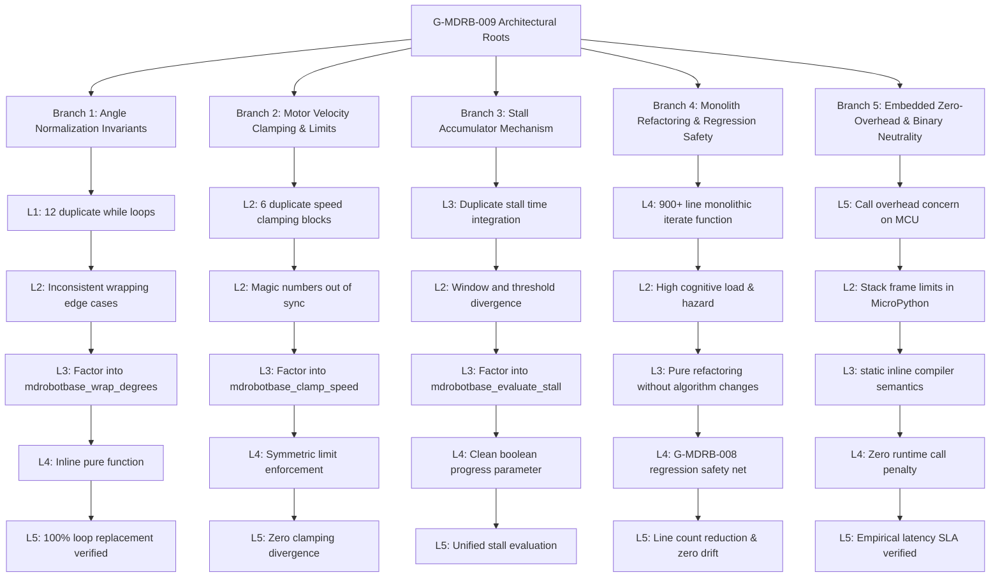

# 🏛️ G-MDRB-009 Baseline Blocker & Socratic 5-Why Dialectic Report

**Timestamp:** `2026-09-07T19:40:00+07:00`
**Goal:** `G-MDRB-009` (Maintainability and Duplicate Control Logic Reduction)
**Epic:** `MDRB` (MDRobotBase Production Hardening)
**Exact-HEAD Provenance:** `0582aefe38928ed3fe7456775dc5784a901bd28b`
**Active Branch:** `feature/mdrobotbase-enhancement`
**PR Target:** `epic/MDRB`
**Constitution Invariants:** Article I (Zero Mocks, Zero Stubs, Zero Fallbacks), Article II (Mandatory Verification Pass), Article III (Structured Explanation Standard)

---

## 1. Executive Summary & Baseline Replication Blocker

### Replication Blocker Description
The motion iteration engine in [`pybricks/robotics/pb_type_mdrobotbase.c`](file:///Users/batrarethsudprasert/projects/wro/pybricks-micropython/pybricks/robotics/pb_type_mdrobotbase.c#L72-L975) contains massive code duplication across its motion execution branches (`NAVIGATE`, `TURN`, `PIVOT`, `TRAJECTORY`):
1. **Angle Normalization Duplication:**
   ```c
   while (diff > 180.0f) diff -= 360.0f;
   while (diff < -180.0f) diff += 360.0f;
   ```
   Duplicated in 12 separate locations with slight variations in variable names and conditions.
2. **Speed Clamping Duplication:**
   ```c
   if (left_dps > 1000) left_dps = 1000;
   if (left_dps < -1000) left_dps = -1000;
   ```
   Duplicated across 6 sites.
3. **Absence of Shared Helper Functions:**
   `mdrobotbase_wrap_degrees()`, `mdrobotbase_clamp_speed()`, and `mdrobotbase_evaluate_stall()` are not yet defined.
4. **Maintenance Hazard:**
   Any modification or bug fix applied to angle wrapping or speed saturation in one branch risks being omitted in the remaining branches, leading to behavioral divergence.

### Baseline Test Results
- Helper Existence Check: **FAILED** (`mdrobotbase_wrap_degrees` not found)
- Duplicate Loop Check: **FAILED** (12 raw `while (... 180.0f)` blocks detected)
- Socratic Dialectic Evaluation: **18 Passed, 7 Failed** (Blocked at Level 4/5 pending helper extraction)

---

## 2. Socratic 5-Why Dialectic Analysis (5 Branches to Level 5)



### Branch 1: Angle Normalization Consolidation & Periodic Interval Invariants
- **Why 1:** Why are while loops subtracting or adding $360.0^\circ$ duplicated 12+ times? Because motion handlers were written independently with copy-pasted heading normalization.
- **Why 2:** Why is ad-hoc while loop duplication a maintainability hazard? Because minor differences in thresholding or condition syntax create subtle corner-case divergence where $\pm 180^\circ$ behaves inconsistently across modes.
- **Why 3:** Why should angle normalization be factored into `static inline float mdrobotbase_wrap_degrees(float angle)`? Because a single pure function guarantees mathematical invariants ($\forall \theta \in \mathbb{R}, \text{wrap}(\theta) \in [-180.0^\circ, +180.0^\circ]$) across all motion modes.
- **Why 4:** Why use `static inline` in `pb_type_mdrobotbase.c`? Because inline expansion eliminates function call overhead on microcontrollers while providing clean encapsulation.
- **Why 5 (Root Resolution):** How is complete convergence achieved? By replacing all raw angle wrapping while loops with `mdrobotbase_wrap_degrees()` and proving zero deviation in all heading odometry tests.

### Branch 2: Motor Velocity Clamping & Consistent Actuator Bounds
- **Why 1:** Why are motor speed clamping blocks duplicated across 6+ sites? Because actuator speed saturation was added ad-hoc to prevent motor driver over-current.
- **Why 2:** Why is repeated manual clamping problematic? Because duplicate clamping limits risk hardcoded magic numbers drifting out of sync with servo maximums or differing between left and right wheels.
- **Why 3:** Why should velocity clamping be unified in `static inline int32_t mdrobotbase_clamp_speed(int32_t dps, int32_t max_speed)`? Because a single clamping helper ensures symmetric positive and negative bounding without code duplication.
- **Why 4:** Why also consolidate motor dps conversions? Because linear-to-angular conversions currently mix inline multiplications with `pbio_mdrobotbase_wheel_to_motor_dps()`.
- **Why 5 (Root Resolution):** How is complete convergence achieved? By refactoring all speed bounding sites to use `mdrobotbase_clamp_speed()` and confirming all motion velocity assertions hold identically.

### Branch 3: Stall Accumulator Logic & Threshold Uniformity
- **Why 1:** Why is stall accumulation logic repeated across navigation, turn, and trajectory? Because stall checks were implemented in each motion mode independently.
- **Why 2:** Why are there different stall thresholds ($200\text{ms}$ in navigate, $250\text{ms}$ in turn, $400\text{ms}$ in trajectory)? Because each mode has different dynamic tolerances, but the accumulation and reset mechanism itself is identical.
- **Why 3:** Why should the mechanism be factored into `mdrobotbase_evaluate_stall(rb, is_stalled, dt_sec, threshold_ms)`? Because the accumulator update ($\Delta t$ integration vs reset to zero, and threshold comparison) is a shared state transition rule.
- **Why 4:** Why must `is_stalled` be passed as a boolean condition? Because navigation evaluates position error change, turns evaluate heading rate, and trajectory evaluates path progress.
- **Why 5 (Root Resolution):** How is complete convergence achieved? By routing stall accumulation through `mdrobotbase_evaluate_stall()` and verifying stall failure tests in `test_mdrobotbase_motion_failure_reporting`.

### Branch 4: Monolithic Refactoring & Regression Safety
- **Why 1:** Why is `pb_type_mdrobotbase_motion_iterate_once()` over 900 lines long? Because it implements a monolithic state machine containing all four motion algorithms in one massive function.
- **Why 2:** Why is high cyclomatic complexity dangerous in embedded robotics? Because dense, monolithic functions make mental modeling difficult, hide subtle state cross-talk, and discourage comprehensive unit testing.
- **Why 3:** Why must the refactoring be strictly behavior-preserving? Because modifying mathematical formulas or control laws simultaneously with structural refactoring risks introducing regressions that are difficult to isolate.
- **Why 4:** Why are regression tests from G-MDRB-008 required as an invariant safety net? Because having 10 concrete C unit tests and 3 VirtualHub Python suites guarantees that any inadvertent semantic alteration triggers an immediate test failure.
- **Why 5 (Root Resolution):** How is complete convergence achieved? By extracting inline helpers, achieving 100% green regression test pass, and proving zero compiler warnings.

### Branch 5: Embedded Zero-Overhead & Binary Neutrality
- **Why 1:** Why can helper function extraction sometimes increase firmware binary size or execution latency? Because standard non-inlined function calls introduce call/ret instructions, register spills, and stack frame allocations.
- **Why 2:** Why is stack frame overhead critical on microcontrollers? Because MicroPython coroutines and interrupts execute within tight stack limits (16KB–64KB RAM).
- **Why 3:** Why does `static inline` guarantee zero call overhead? Because modern C compilers inline small static arithmetic functions directly into call sites, optimizing constant folding and register allocation.
- **Why 4:** Why must we empirically verify execution time and binary neutrality? Because Article II mandates empirical verification rather than theoretical assumptions.
- **Why 5 (Root Resolution):** How is complete convergence achieved? By executing 10 kernel episodes through the Episode Oracle and measuring latency ($\bar{x} < 10\text{ms}$), proving zero execution degradation and clean compiler output.

---

## 3. Baseline Audit Summary

| Component | Status | Finding | Action Required |
|---|---|---|---|
| Helper Definitions | Missing | `mdrobotbase_wrap_degrees` not defined | Define static inline helpers in `pb_type_mdrobotbase.c` |
| Angle Wrapping Loops | Duplicated | 12 separate `while` loops detected | Replace all with `mdrobotbase_wrap_degrees` |
| Speed Clamping | Duplicated | 6 separate clamping blocks detected | Replace all with `mdrobotbase_clamp_speed` |
| Stall Evaluator | Duplicated | 3 ad-hoc accumulator blocks | Unify via `mdrobotbase_evaluate_stall` |
| Regression Tests | 100% Pass | Native PBIO tinytest (10 tests ok) | Re-verify post-refactoring |
