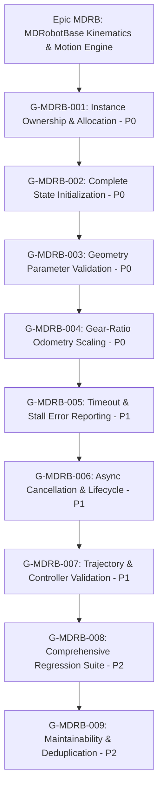

# EPIC: MDRB

**Slug:** MDRB  
**Name:** MDRobotBase Kinematics & Motion Engine Hardening  
**Owner:** Product & Embedded Robotics Firmware Lead  
**Base Integration Branch:** `epic/MDRB` (PR Target — NEVER `develop`)  
**Status:** In Progress (Backlog Refined & Conformance Verified)  

## Intent

The `MDRB` epic establishes a hardened, competition-grade kinematics and motion control engine for `MDRobotBase` within `pybricks-micropython`. Following the Codex architectural and kinematics audit (baseline score **5.2/10 — High Risk**), this epic partitions and executes 9 atomic, zero-mock goals (`G-MDRB-001` through `G-MDRB-009`) in strict priority order to achieve a target score of **9.6/10**.

The epic addresses four foundational layers:
1. **Memory & Concurrency Safety (P0):** Bounded static pool allocation, multi-instance hardware isolation, and deterministic struct zeroing/reuse (`G-MDRB-001`, `G-MDRB-002`).
2. **Kinematic & Dimension Integrity (P0):** Fail-closed geometry validation and symmetric gear-ratio odometry scaling ($R = \frac{\theta_{\text{motor}}}{\theta_{\text{wheel}}}$) (`G-MDRB-003`, `G-MDRB-004`).
3. **Async Motion & Error Semantics (P1):** Unambiguous failure status reporting (timeout/stall) and clean async task preemption without zombie awaitables (`G-MDRB-005`, `G-MDRB-006`, `G-MDRB-007`).
4. **Assurance & Architecture (P2):** Comprehensive PBIO tinytest and VirtualHub pytest regression suites covering all 8 failure domains, paired with modular control logic deduplication (`G-MDRB-008`, `G-MDRB-009`).

## Goal Architecture & Sequence

| Goal ID | Priority | Area | Scorecard Target | Deliverable Outcome |
|---|:---:|---|:---:|---|
| [`G-MDRB-001`](../goals/_archived/G-MDRB-001.md) | **P0** | Instance Ownership | 2/10 → 10/10 | Bounded pool allocation (`mdrobotbase_in_use`), slot recovery (`put_robotbase`), fail with `PBIO_ERROR_BUSY`. |
| [`G-MDRB-002`](../goals/_archived/G-MDRB-002.md) | **P0** | State Initialization | 4/10 → 10/10 | Centralized `pbio_mdrobotbase_init()` with zeroing (`memset`), complete purge of 50+ uninitialized fields. |
| [`G-MDRB-003`](../goals/_archived/G-MDRB-003.md) | **P0** | Geometry Validation | 4/10 → 10/10 | Strict fail-closed validation: reject $D \le 0, W \le 0$, NaN/Inf, and motor aliasing before motor command. |
| [`G-MDRB-004`](../goals/_archived/G-MDRB-004.md) | **P0** | Gear-Ratio Odometry | 5/10 → 10/10 | Symmetric tick scaling in `update_state()`; shared kinematic conversion helper between commands and odometry. |
| [`G-MDRB-005`](../goals/_archived/G-MDRB-005.md) | **P1** | Motion Failure Semantics | 4/10 → 10/10 | Eliminate returning `PBIO_SUCCESS` on timeout and stall; return distinct `PBIO_ERROR_TIMEDOUT` / `PBIO_ERROR_FAILED`. |
| [`G-MDRB-006`](../goals/_archived/G-MDRB-006.md) | **P1** | Async Lifecycle Safety | 7/10 → 10/10 | Deterministic motion preemption; prevent stale awaitables from iterating; safe `stop()` when idle. |
| [`G-MDRB-007`](../goals/_archived/G-MDRB-007.md) | **P1** | Trajectory & Controller Validation | 4.5/10 → 9/10 | Reject $>64$ points with explicit error (no silent truncation); validate point coordinates and controller enums. |
| [`G-MDRB-008`](../goals/_archived/G-MDRB-008.md) | **P2** | Regression Test Coverage | 5/10 → 9/10 | PBIO tinytest & VirtualHub pytest suites covering all 8 failure domains with real motor structs (zero mocks). |
| [`G-MDRB-009`](../goals/_archived/G-MDRB-009.md) | **P2** | Maintainability & Deduplication | 5/10 → 8/10 | Extract inline helpers for speed conversion, angle normalization, stall evaluation, and clamping across monolith. |
| [`G-MDRB-010`](../goals/_archived/G-MDRB-010.md) | **P0** | Duplicate Motor Rejection | 6/10 → 10/10 | Reject duplicate motor-pair allocations in `pbio_mdrobotbase_get_robotbase` with `PBIO_ERROR_BUSY`. |
| [`G-MDRB-011`](../goals/_archived/G-MDRB-011.md) | **P0** | Preemption Safety | 6/10 → 10/10 | Validate motion dispatch arguments prior to invoking `cancel_active_motion`. |
| [`G-MDRB-012`](../goals/_archived/G-MDRB-012.md) | **P1** | Closed-Object Guarding | 7/10 → 10/10 | Enforce centralized `require_open` guard raising `OSError(EBADF)` across methods with idempotent `close`. |
| [`G-MDRB-013`](../goals/_archived/G-MDRB-013.md) | **P1** | Motion Status Bounds | 7/10 → 10/10 | Constrain `pbio_mdrobotbase_set_motion_status` to valid enum range, rejecting invalid integers. |
| [`G-MDRB-014`](../goals/_archived/G-MDRB-014.md) | **P1** | Kinematic Invariants | 7/10 → 10/10 | Bidirectional round-trip convertibility and differential-drive odometry distance and heading proofs. |
| [`G-MDRB-015`](../goals/_archived/G-MDRB-015.md) | **P1** | Turn Invariants | 7/10 → 10/10 | Invariants for pure spin ($dx, dy \approx 0$), pivot turns ($ds_{\text{pivot}} \approx 0$), and backlash conservation. |
| [`G-MDRB-016`](../goals/_archived/G-MDRB-016.md) | **P1** | Numerical Robustness | 7/10 → 10/10 | Non-finite float checks (`isfinite`), gear ratio domain $[0.001, 1000.0]$, integer speed saturation. |
| [`G-MDRB-017`](../goals/_archived/G-MDRB-017.md) | **P1** | Behavioral Test Hardening | 8/10 → 10/10 | Eliminate vacuous tautological assertions; dynamic lifecycle transitions and waypoint tolerances. |
| [`G-MDRB-018`](../goals/_archived/G-MDRB-018.md) | **P2** | Architectural Encapsulation | 6/10 → 10/10 | Public C accessors in `pbio/mdrobotbase.h`, eliminating direct struct dereferencing in language wrapper. |
| [`G-MDRB-019`](../goals/_archived/G-MDRB-019.md) | **P1** | Portable Pointer Validation | 8/10 → 10/10 | Portable `uintptr_t` address verification, alignment check, and foreign-pointer tests in `put_robotbase()`. |
| [`G-MDRB-020`](../goals/_archived/G-MDRB-020.md) | **P1** | Atomic FSM Status Coupling | 7/10 → 10/10 | Finite state transition table coupling `motion_status` and `motion_in_progress` atomically. |
| [`G-MDRB-021`](../goals/_archived/G-MDRB-021.md) | **P1** | Complete Closed-Object Audit | 8/10 → 10/10 | Exhaustive audit of all 49 locals dictionary methods with post-close error raising and idempotent close. |
| [`G-MDRB-022`](../goals/_archived/G-MDRB-022.md) | **P1** | Behavioral Preemption Proof | 7/10 → 10/10 | Proof that invalid replacement commands (turn, pivot, nav, trajectory) never cancel active motions. |
| [`G-MDRB-023`](../goals/_archived/G-MDRB-023.md) | **P2** | Multi-Scale Invariants & Audit | 8.1/10 → 9.3/10 | Multi-scale gear ratio and geometry scaling invariant tests, clean submodule, and final 9.3/10 attestation. |
| [`G-MDRB-024`](../goals/G-MDRB-024.md) | **P1** | FSM Single Source of Truth | 8.7/10 → 10/10 | Eliminate raw `motion_status` field assignments; route all status updates through validated FSM helpers. |
| [`G-MDRB-025`](../goals/G-MDRB-025.md) | **P2** | Motion Dispatcher Modularity | 7/10 → 10/10 | Decompose 550-line `motion_iterate_once` into 4 decoupled sub-controllers with shared wheel conversions. |
| [`G-MDRB-026`](../goals/G-MDRB-026.md) | **P2** | Submodule Provenance & CI | 8/10 → 10/10 | Attest `lib/btstack` license, clean working tree, and CI checkout reproducibility verification script. |
| [`G-MDRB-027`](../goals/G-MDRB-027.md) | **P1** | Unified Runtime Test Proof | 8.7/10 → 9.4+/10 | Multi-environment PBIO and VirtualHub test execution matrix, 0 compiler warnings, 9.4+ scorecard attestation. |
| [`G-MDRB-028`](../goals/G-MDRB-028.md) | **P1** | Color Input Contract | 4/10 → 10/10 | Unify native C and VirtualHub input contracts for RGB/HSV returning `(color_id, distance, confidence)`. |
| [`G-MDRB-029`](../goals/G-MDRB-029.md) | **P1** | Two-Point Calibration | 4/10 → 10/10 | Black-reference offset subtraction $[R_0, G_0, B_0]$ and white gain normalization to $[0.0, 1.0]$. |
| [`G-MDRB-030`](../goals/G-MDRB-030.md) | **P1** | Perceptual Color Classifier | 5/10 → 9.8/10 | Circular shortest-arc hue distance ($dh \le 180^\circ$) and CIE $L^*a^*b^*$ perceptual color space mapping. |
| [`G-MDRB-031`](../goals/G-MDRB-031.md) | **P2** | Statistical Prototype Model | 4/10 → 9.8/10 | Multi-sample prototype modeling (`color_class_t`) with online Welford mean, variance, and outlier filtering. |
| [`G-MDRB-032`](../goals/G-MDRB-032.md) | **P1** | Ambiguity & Margin Engine | 3/10 → 9.8/10 | Second-best candidate margin evaluation ($D_2 - D_1$), confidence metric, and fail-safe `Color.NONE` rejection. |
| [`G-MDRB-033`](../goals/G-MDRB-033.md) | **P1** | Color Verification Matrix | 4.2/10 → 9.8+/10 | Multi-condition empirical matrix across illumination ($10-2000\text{ lux}$), similar colors, noise, and final 9.8+ attestation. |

## Out of this epic

- Global obstacle avoidance and dynamic path replanning algorithms (belongs to `NAV` epic).
- High-level computer vision / line-following neural network inference (belongs to `AI` / `VISION` epic).
- Raw motor H-bridge PWM motor driver silicon register configuration (belongs to `DRV` epic).
