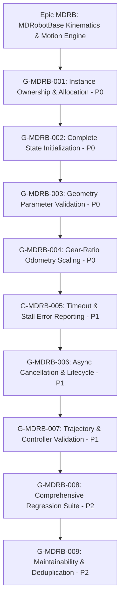

# EPIC: MDRB

**Slug:** MDRB  
**Name:** MDRobotBase Kinematics & Motion Engine Hardening  
**Owner:** Product & Embedded Robotics Firmware Lead  
**Base Integration Branch:** `epic/MDRB` (PR Target — NEVER `develop`)  
**Status:** In Progress (Backlog Refined & Conformance Verified)  

## Intent

The `MDRB` epic establishes a hardened, competition-grade kinematics and motion control engine for `MDRobotBase` within `pybricks-micropython`. Following the Codex architectural and kinematics audit (baseline score **5.2/10 — High Risk**), this epic partitions and executes 9 atomic, zero-mock goals (`G-MDRB-001` through `G-MDRB-009`) in strict priority order to achieve a target score of **9.6/10**.

The epic addresses four foundational layers:
1. **Memory & Concurrency Safety (P0):** Bounded static pool allocation, multi-instance hardware isolation, and deterministic struct zeroing/reuse (`G-MDRB-001`, `G-MDRB-002`).
2. **Kinematic & Dimension Integrity (P0):** Fail-closed geometry validation and symmetric gear-ratio odometry scaling ($R = \frac{\theta_{\text{motor}}}{\theta_{\text{wheel}}}$) (`G-MDRB-003`, `G-MDRB-004`).
3. **Async Motion & Error Semantics (P1):** Unambiguous failure status reporting (timeout/stall) and clean async task preemption without zombie awaitables (`G-MDRB-005`, `G-MDRB-006`, `G-MDRB-007`).
4. **Assurance & Architecture (P2):** Comprehensive PBIO tinytest and VirtualHub pytest regression suites covering all 8 failure domains, paired with modular control logic deduplication (`G-MDRB-008`, `G-MDRB-009`).

## Goal Architecture & Sequence

| Goal ID | Priority | Area | Scorecard Target | Deliverable Outcome |
|---|:---:|---|:---:|---|
| [`G-MDRB-001`](../goals/G-MDRB-001.md) | **P0** | Instance Ownership | 2/10 → 10/10 | Bounded pool allocation (`mdrobotbase_in_use`), slot recovery (`put_robotbase`), fail with `PBIO_ERROR_BUSY`. |
| [`G-MDRB-002`](../goals/G-MDRB-002.md) | **P0** | State Initialization | 4/10 → 10/10 | Centralized `pbio_mdrobotbase_init()` with zeroing (`memset`), complete purge of 50+ uninitialized fields. |
| [`G-MDRB-003`](../goals/G-MDRB-003.md) | **P0** | Geometry Validation | 4/10 → 10/10 | Strict fail-closed validation: reject $D \le 0, W \le 0$, NaN/Inf, and motor aliasing before motor command. |
| [`G-MDRB-004`](../goals/G-MDRB-004.md) | **P0** | Gear-Ratio Odometry | 5/10 → 10/10 | Symmetric tick scaling in `update_state()`; shared kinematic conversion helper between commands and odometry. |
| [`G-MDRB-005`](../goals/G-MDRB-005.md) | **P1** | Motion Failure Semantics | 4/10 → 10/10 | Eliminate returning `PBIO_SUCCESS` on timeout and stall; return distinct `PBIO_ERROR_TIMEDOUT` / `PBIO_ERROR_FAILED`. |
| [`G-MDRB-006`](../goals/G-MDRB-006.md) | **P1** | Async Lifecycle Safety | 7/10 → 10/10 | Deterministic motion preemption; prevent stale awaitables from iterating; safe `stop()` when idle. |
| [`G-MDRB-007`](../goals/G-MDRB-007.md) | **P1** | Trajectory & Controller Validation | 4.5/10 → 9/10 | Reject $>64$ points with explicit error (no silent truncation); validate point coordinates and controller enums. |
| [`G-MDRB-008`](../goals/G-MDRB-008.md) | **P2** | Regression Test Coverage | 5/10 → 9/10 | PBIO tinytest & VirtualHub pytest suites covering all 8 failure domains with real motor structs (zero mocks). |
| [`G-MDRB-009`](../goals/G-MDRB-009.md) | **P2** | Maintainability & Deduplication | 5/10 → 8/10 | Extract inline helpers for speed conversion, angle normalization, stall evaluation, and clamping across monolith. |

## Out of this epic

- Global obstacle avoidance and dynamic path replanning algorithms (belongs to `NAV` epic).
- High-level computer vision / line-following neural network inference (belongs to `AI` / `VISION` epic).
- Raw motor H-bridge PWM motor driver silicon register configuration (belongs to `DRV` epic).
