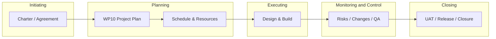

# {{project_name}}

**Project Plan**

**Document Version:** 1.0
**Author:** {{author}}
**Approval Date:** {{date}}

> **Agent guidance:** Fill every section from approved `intake/context/` and `project-context.yaml`. Do not invent scope, dates, budget, or team members not present in context. Use Agreement/SOW feature IDs (F-01, F-02, …) consistently with WP13.

### Revision History

| No | Version | Date | Description | Author | Status |
| :---: | :---: | ----- | ----- | ----- | ----- |
| 1 | 0.1 | {{date}} | Initial draft created based on the signed Agreement/SOW. Includes high-level objectives, scope summary, and initial team roles. | {{author}} | Draft |
| 2 | 1.0 | {{date}} | Approved and baselined. | {{author}} | Approved |

---

### Table of Contents

1. [Project Title](#1-project-title)
2. [General Information](#2-general-information)
3. [Objectives](#3-objectives)
4. [Scope of Work](#4-scope-of-work)
5. [Deliverables](#5-deliverables)
6. [Project Structure, Roles, and Responsibilities](#6-project-structure-roles-and-responsibilities)
7. [Project Schedule](#7-project-schedule)
8. [Resources and Cost Estimation](#8-resources-and-cost-estimation)
9. [Risk Management](#9-risk-management)
10. [Version Control Strategy](#10-version-control-strategy)
11. [Work Process Flow](#11-work-process-flow)

---

### **1. Project Title** {#1-project-title}

**Project Name:** {{project_name}}

**Project Code:** {{project_code}}

**Description:** {{project_description}}

*Optional tagline or product philosophy (one short paragraph).*

---

### **2. General Information** {#2-general-information}

| Field | Value |
| ----- | ----- |
| **Client Name** | {{client_name}} |
| **Vendor Name** | {{vendor_name}} |
| **Agreement ID** | {{agreement_id}} |
| **Date of Agreement** | {{agreement_date}} |
| **Project Duration** | {{project_duration_start}} — {{project_duration_end}} |
| **Communication Methods** | {{communication_methods}} |
| **Stakeholders** | {{stakeholders}} |

---

### **3. Objectives** {#3-objectives}

Describe measurable objectives aligned with the SOW and product vision. Group into three categories below.

#### **3.1. Product & User Experience Objectives** {#3.1-product-user-experience-objectives}

**3.1.1.** [Primary product outcome — link to core features F-01, F-02, …]

* Example bullets:
  * Deliver [core capability] tied to feature **F-XX**.
  * Foster daily engagement through [F-YY].
  * Provide an intuitive journey for Guest vs Logged-In users (if applicable).

**3.1.2.** [Secondary UX objective]

**3.1.3.** [Accessibility, localization, or customization — e.g. theme, language via F-05]

**3.1.4.** [User control / profile management objective]

#### **3.2. Technical & Architectural Objectives** {#3.2-technical-architectural-objectives}

**3.2.1.** Implement a robust and scalable backend (auth, data model, integrations).

**3.2.2.** Develop a secure, documented API for all client-facing features.

**3.2.3.** Build a stable, performant client application (web/mobile) meeting NFR targets.

#### **3.3. Business & Growth Objectives** {#3.3-business-growth-objectives}

**3.3.1.** Establish a clear funnel for user conversion (guest → registered), if applicable.

**3.3.2.** Lay the foundation for future monetization or feature expansion without scope creep in v1.

---

### **4. Scope of Work** {#4-scope-of-work}

Decompose each in-scope feature from the Agreement/SOW. One row per feature.

#### **4.1 In Scope**

| Feature ID | Objective | Key Functionalities | Non-Functional Requirements |
| :---- | :---- | :---- | :---- |
| **F-01: [Feature Name]** | [One-line objective] | • [Capability 1] • [Capability 2] | **Performance:** [e.g. load &lt; 8s] **Security:** [e.g. TLS, encryption at rest] **Usability:** [design adherence] |
| **F-02: [Feature Name]** | | | |
| **F-03: [Feature Name]** | | | |
| *(Add rows for all SOW features)* | | | |

#### **4.2 Out of Scope**

Explicit exclusions prevent scope creep. List per feature ID.

| Feature ID | Excluded Items |
| ----- | ----- |
| **F-01** | • [Excluded capability] • [Excluded capability] |
| **F-02** | • [Excluded capability] |
| **F-03** | • [Excluded capability] |

---

### **5. Deliverables** {#5-deliverables}

#### **5.1 Application Deliverables** {#5.1-application-deliverables}

* **[Platform] Application:** Final build/package ready for store or production deployment (e.g. `.apk`, `.aab`, production URL).
* **Source Code Repository:** Complete, documented source for all application tiers, hosted on the project VCS.

#### **5.2 Documentation Deliverables** {#5.2-documentation-deliverables}

* **User Stories & Requirements Document (WP13):** Functional and non-functional requirements for the release.
* **UI/UX Design Files (WP15/WP16):** Final designs, components, and user flows.
* **Technical Architecture Document:** System architecture, data models, API specifications (OpenAPI/Swagger where applicable).
* **Testing & QA Plan (WP19/WP20):** Strategy, test cases, UAT plan.
* **Deployment & Operations Guide (WP05/WP06):** Deploy, run, monitor, and maintain services.

#### **5.3 Project Management Deliverables** {#5.3-project-management-deliverables}

* **Project Plan (WP10):** This document, baselined.
* **Sprint / iteration records:** Planning, review, retrospective artifacts.
* **Project Closure Report:** Outcomes, planned vs actual, lessons learned.

---

### **6. Project Structure, Roles, and Responsibilities** {#6-project-structure-roles-and-responsibilities}

Define team structure, RACI-style ownership, and how the team collaborates.

#### **6.1 Project Team Roles & Responsibilities** {#6.1-project-team-roles-responsibilities}

| Role | Name | Key Responsibilities |
| ----- | ----- | ----- |
| **Project Manager** | [Name] | Planning, schedule, budget, Scrum ceremonies, risk and impediments. |
| **Product Owner** | [Name] | Vision, backlog prioritization, stakeholder decisions, story sign-off. |
| **UI/UX Designer** | [Name] | Wireframes, mockups, design system, user journeys. |
| **Lead Developer (Client)** | [Name] | Client app implementation, quality, release packaging. |
| **Lead Developer (Server)** | [Name] | API, database, integrations, security, scalability. |
| **QA Engineer** | [Name] | Test plan, execution, defect management, release verification. |
| *(Add roles as needed)* | | |

#### **6.2 Communication Plan** {#6.2-communication-plan}

* **Daily:** [Channel — e.g. Discord, Slack] for coordination.
* **Weekly stakeholder update:** [Day] — email summary or short meeting (progress, risks, next steps).
* **Sprint ceremonies:** [Channel — e.g. Google Meet] for planning, review, retrospective.
* **Escalation:** [Who] when blockers exceed [threshold].

---

### **7. Project Schedule** {#7-project-schedule}

Major phases, milestones, and dates. Align with Agreement dates and sprint length (e.g. 2 weeks).

| Phase | Duration | Start Date | End Date | Key Milestones & Deliverables |
| ----- | ----- | ----- | ----- | ----- |
| **Phase 1: Requirements Gathering** | [N weeks] | [YYYY-MM-DD] | [YYYY-MM-DD] | Kick-off; requirements & user stories; signed agreement baseline |
| **Phase 2: Project Planning** | [N weeks] | | | WBS; schedule; resource plan; risk register; approved PM plan |
| **Phase 3: Design** | [N weeks] | | | Architecture; API spec; UI/UX approval |
| **Phase 4: Development** | [N weeks] | | | Feature milestones per F-01…F-XX |
| **Phase 5: Integration & Testing** | [N weeks] | | | Staging build; E2E tests; RTM draft |
| **Phase 6: UAT & Release Prep** | [N weeks] | | | Beta/UAT; defect fix; release candidate |
| **Phase 7: Launch & Handover** | [N weeks] | | | Production release; ops docs; closure sign-off |

**Detailed schedule (optional):** [Link to spreadsheet or Gantt — `{{schedule_link}}`]

---

### **8. Resources and Cost Estimation** {#8-resources-and-cost-estimation}

#### **8.1 Human Resources** {#8.1-human-resources}

| Role | FTE | Duration |
| ----- | ----- | ----- |
| Project Manager | [n] | [months] |
| Product Owner | [n] | [months] |
| UI/UX Designer | [n] | [months] |
| Developer(s) | [n] | [months] |
| QA Engineer | [n] | [months] |

*FTE = Full-Time Equivalent*

#### **8.2 Software & Services** {#8.2-software-services}

* Project management: [e.g. ClickUp, Jira]
* Design: [e.g. Figma]
* Cloud hosting: [provider]
* Third-party APIs: [list]
* Store / distribution accounts: [if applicable]

#### **8.3 Cost Estimation** {#8.3-cost-estimation}

| Category | Description | Estimated Cost |
| ----- | ----- | -----: |
| Personnel Costs | Team salaries for engagement period | [amount] |
| Software & Services | Subscriptions and licenses | [amount] |
| Infrastructure Costs | Hosting, storage, traffic | [amount] |
| **Subtotal** | | **[amount]** |
| Contingency ([%]) | Reserve for unforeseen work | [amount] |
| Project Management | PM overhead, ceremonies | [amount] |
| **Total Estimated Budget** | | **[amount]** |

*Use project currency; align totals with Agreement if fixed-price.*

---

### **9. Risk Management** {#9-risk-management}

#### **9.1 Risk Evaluation Strategy**

Assess risks using **Likelihood** (Very Likely / Possible / Unlikely) and **Impact** (Severe / Significant / Minor). Prioritize mitigation for high likelihood × high impact items.

#### **9.2 Risk Register**

| ID | Risk Description | Category | Likelihood | Impact | Mitigation Strategy |
| ----- | ----- | ----- | ----- | ----- | ----- |
| R01 | [e.g. Third-party API unreliable] | Technical | [L/M/H] | [L/M/H] | [Mitigation steps] |
| R02 | [e.g. Content delivery delays] | Schedule | | | |
| R03 | [e.g. Scope creep] | Scope | | | |
| R04 | [e.g. Key person unavailable] | Resource | | | |
| R05 | [e.g. Performance on low-end devices] | Technical | | | |
| R06 | [e.g. Store submission rejection] | Schedule | | | |

---

### **10. Version Control Strategy** {#10-version-control-strategy}

#### **10.1 Naming Convention** {#10.1-naming-convention}

| Artifact | Pattern | Example |
| :---- | :---- | :---- |
| **Documents** | `{{company_code}}_{{project_code}}_<document>_v<major.minor>` | `{{company_code}}_{{project_code}}_PP_v1.0` |
| **Backups** | `{{company_code}}_{{project_code}}_<service>_YYYY-MM-DD_HH-MM` | `{{company_code}}_{{project_code}}_DB_2026-01-15_02-00` |

#### **10.2 Document Version Control & Backup** {#10.2-document-version-control}

Day-to-day versions via [Drive / Git / SharePoint] version history. Baselined versions use the naming convention above.

#### **10.3 Database Backup Strategy** {#10.3-database-backup-strategy}

| Item | Value |
| ----- | ----- |
| **Location** | [host / region] |
| **Frequency** | [e.g. daily automated full backup] |
| **Retention** | [policy] |

---

### **11. Work Process Flow** {#11-work-process-flow}

Project management follows the five PMI process groups:

| Process Group | ISO 29110 / Team Activities |
| ----- | ----- |
| **Initiating** | Agreement (WP02), project kick-off, context pack intake |
| **Planning** | This plan (WP10), requirements (WP13), design (WP15/16), test strategy (WP19) |
| **Executing** | Development, configuration management, QA execution |
| **Monitoring & Control** | Change requests (WP03), risks, status meetings (WP07), defect tracking |
| **Closing** | Acceptance (WP01), handover (WP06), closure report |

*Replace the diagram with a company-specific workflow image if required by your QMS.*

---

**Document ID:** `{{company_code}}_{{project_code}}_PP_v1.0`
**Status:** Draft | For Review | Approved / Baseline
