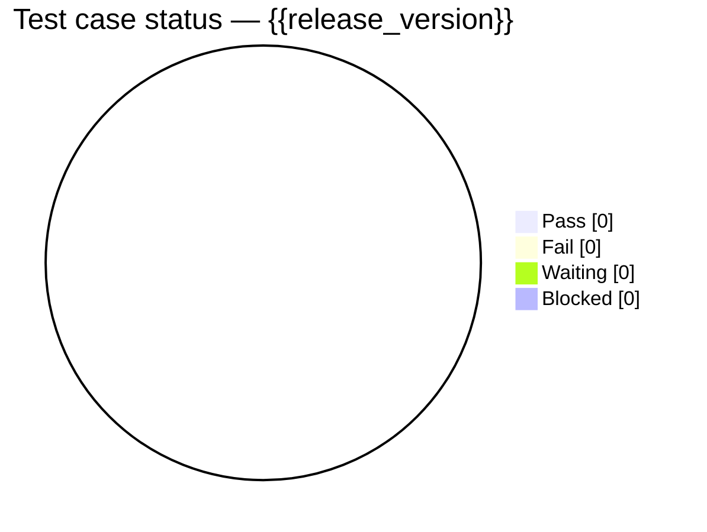
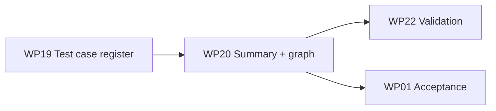

# {{project_name}}

**Test Report** — **WP20** (derived from WP19)

**Document Version:** {{test_report_version}}  
**Date:** {{date}}  
**Author:** {{author}}

> **Same evidence set as WP19 Test Cases.**  
> This report is a **summary + status graph** over the WP19 register — do not maintain a separate disconnected case list.

### Revision History

| Version | Date | Description | Author | Status |
| :---: | :---: | ----- | ----- | :---: |
| 0.1 | {{date}} | Derived draft from WP19 | {{author}} | Draft |
| 1.0 | {{date}} | Baseline for release {{release_version}} | {{author}} | Approved |

---

### 1. Scope

| Field | Value |
| ----- | ----- |
| Project | {{project_name}} |
| Release | {{release_version}} |
| Environment | {{test_environment}} |
| Period | {{test_period_start}} — {{test_period_end}} |
| Test lead | {{test_lead}} |
| Source register | [WP19 Test Cases](../04_Testing/Test-Cases-Procedure.md) |

---

### 2. Summary counts

Copy totals from WP19 summary (or recompute from the WP19 Status column):

| Release | Total | Pass | Fail | Waiting | Blocked |
| :---: | :---: | :---: | :---: | :---: | :---: |
| {{release_version}} | | | | | |

---

### 3. Status graph (from WP19)

Replace counts in the Mermaid chart after tallying WP19 rows:

*(Optional bar view for multiple releases — keep one chart per report version.)*

---

### 4. Open failures / blockers

| TC ID | REQ | Title | Status | Owner | Notes |
| :---: | :---: | ----- | ----- | ----- | ----- |
| | | | | | |

---

### 5. Conclusion

- [ ] All P0/P1 cases Pass or waived with PO approval  
- [ ] Failures logged in WP04 (ClickUp correction register)  
- [ ] Ready for WP22 Validation / WP01 Acceptance  

| Role | Name | Date | Decision |
| ----- | ----- | ----- | ----- |
| Test lead | {{test_lead}} | {{date}} | |
| Project Manager | {{author}} | {{date}} | |
